# 코딩용 Astra, 우리는 왜 또 이러고 있나 — 나레이션 대본

Armin Ronacher의 "Astra for Coding: Why Are We Doing This Again?"(lucumr.pocoo.org, 2026-09-07)를 한 사람이 들려주듯 풀어 쓴 대본.
원문 번역이 아니라 [정리 노트](../../content/notes/astra-why.md)를 바탕으로 요지를 다시 서술한 것이다. 원문의 코드 조각은 옮기지 않고, 코드 그림은 모양만 보여 주려고 새로 지어낸 예시다.

형식은 `../build.py` 머리말 참고. `python3 ../build.py astra-why`로 굽는다(세로 1080x1920).

출처: Armin Ronacher, 〈Astra for Coding〉 2026년 9월
잉크: #8C4A12
약어: AI=Artificial Intelligence, 인공지능; GPT=Generative Pre-trained Transformer; API=Application Programming Interface; AGI=Artificial General Intelligence, 범용 인공지능

## 1 | 들어가며 | 표지
> 코딩용 Astra: / 우리는 왜 또 이러고 있나
> Armin Ronacher, Astra for Coding: Why Are We Doing This Again?, 2026년 9월
> Flask를 만든 개발자가 GPT 6 Astra에게 주말 동안 소프트웨어 공장을 맡겨 본 기록

AI 코딩 에이전트에게 큰 일을 통째로 맡기고 주말 내내 내버려 두면 무슨 일이 일어날까요? 오늘 소개할 글이 바로 그 실험의 기록입니다. 서른다섯 시간, 토큰 약 10억 개, 비용 약 1,200달러. 그렇게 해서 얻은 코드가 75,000줄인데, 저자의 결론은 쓸 만한 게 하나도 없었다는 거예요. 제목은 Astra for Coding, Why Are We Doing This Again. 코딩용 Astra, 우리는 왜 또 이러고 있나 정도로 옮길 수 있겠습니다.

## 2 | 배경 | 누가 썼나
> 저자는 Armin Ronacher
> Flask, Jinja, Werkzeug를 만든 개발자. CPython 기여자, Sentry에서 오래 일했다
> 지금은 자신의 에이전트 하니스 Pi를 만든다

글쓴이는 Armin Ronacher입니다. 파이썬 웹 프레임워크 Flask와 템플릿 엔진 Jinja를 만든 사람이에요. CPython에도 오래 기여해 왔고 오류 모니터링 회사 Sentry에서 오래 일했습니다. 지금은 Pi라는 자기 에이전트 하니스를 만들고 있어요. 그러니까 파이썬 코드의 모양에 누구보다 까다로운 사람이 OpenAI의 새 모델 GPT 6 Astra로 큰 실험을 해 보고 쓴 글입니다. 글의 흐름을 따라가면서 제 생각도 조금씩 보태 보겠습니다.

## 3 | 배경 | 내권
> 글의 첫 단어, **내권(内卷)**
> 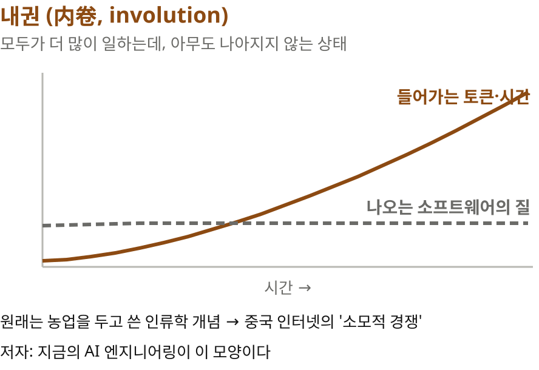

글은 내권이라는 말로 시작합니다. 중국어로는 네이쥐안이라고 읽는데요. 원래는 농업을 두고 쓰던 인류학 개념이에요. 땅 한 뙈기에서 나오는 수확은 늘어나는데 일하는 사람 한 명당 생산성은 제자리인 상태를 말합니다. 이 말이 중국 인터넷에서 모두가 더 많이 일하는데 아무도 나아지지 않는 소모적 경쟁이라는 뜻으로 퍼졌어요. 아침 아홉 시부터 밤 아홉 시까지 주 6일 일하는 996 문화와 함께 자주 나오는 말이고요.

> 들어가는 토큰과 시간은 느는데, **나오는 소프트웨어는 그대로**

저자는 지금의 AI 엔지니어링이 딱 그 모양이라고 봅니다. 들어가는 토큰과 시간은 계속 늘어나는데 나오는 소프트웨어는 나아지지 않는다는 거죠. 글 전체가 이 첫 단어를 증명하는 과정이라고 봐도 됩니다.

## 4 | 실험 | 소프트웨어 공장
> 주말 동안 Astra에게 맡긴 **소프트웨어 공장**
> 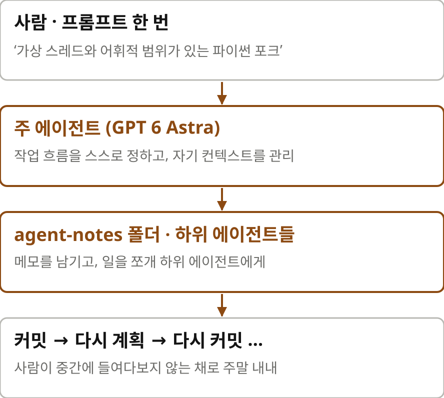

실험은 이렇습니다. 저자는 주말 동안 GPT 6 Astra에게 소프트웨어 공장을 맡겼어요. 소프트웨어 공장이란 사람은 프롬프트 하나만 주고 나머지는 모델이 알아서 돌리는 방식을 말합니다. 모델이 스스로 작업 흐름을 정하고, 자기 컨텍스트를 관리하고, agent-notes라는 폴더에 메모를 남기면서 큰 과제를 혼자 끌고 가는 거죠. 과제는 파이썬을 포크해서 가상 스레드와 어휘적 범위를 넣는 것이었어요. 저자 스스로도 어리석은 프롬프트였다고 인정합니다. 그런데 그래서 오히려 더 잘 보이는 게 있었다고 해요.

> **하위 에이전트**란
> 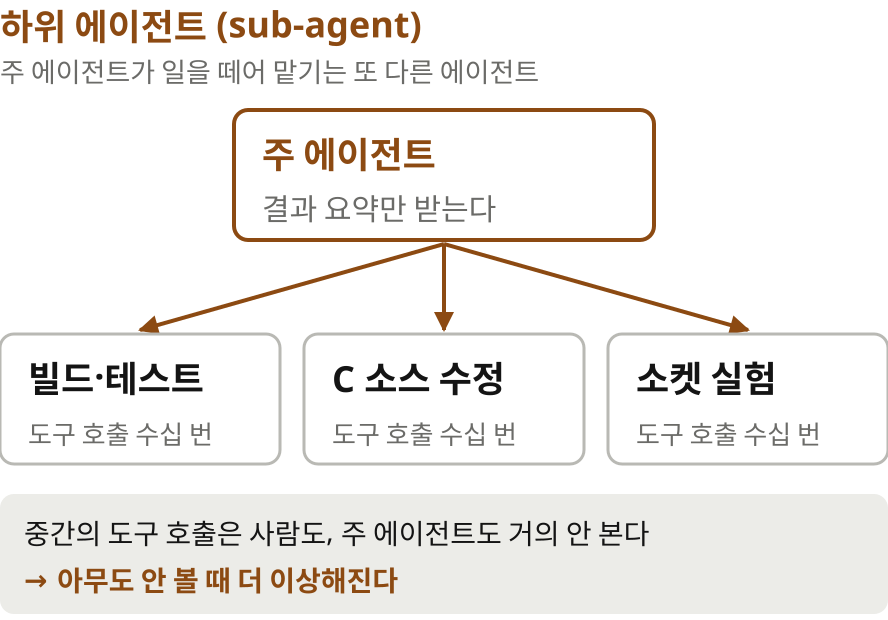

여기서 하나 알아 둘 개념이 하위 에이전트입니다. 주 에이전트가 큰 일을 쪼개서 다른 에이전트에게 맡기는 거예요. 빌드와 테스트를 맡은 에이전트, C 소스를 고치는 에이전트, 소켓을 실험하는 에이전트, 이런 식으로요. 하위 에이전트는 도구를 수십 번 부르며 일하고 주 에이전트는 결과 요약만 받습니다. 그러니 그 중간 과정은 사람도, 주 에이전트도 거의 들여다보지 않아요. 이 점을 기억해 두세요. 뒤에서 중요해집니다.

## 5 | 슬롭 공장 | 결과와 가설
> 내 **슬롭 공장**
> 약 35시간, 엄청난 양의 토큰, 가치 있는 결과물은 없음
> 다만 들여다볼 거리는 많이 남았다

결과부터 말하면 저자는 이 장을 내 슬롭 공장이라고 이름 붙였습니다. 슬롭은 AI가 쏟아 내는 질 낮은 결과물을 가리키는 말이에요. 서른다섯 시간쯤 돌렸고 ChatGPT 사용 한도가 한 번 리셋될 만큼 토큰을 썼는데 가치 있는 결과물은 없었다고 합니다. 다만 들여다볼 거리는 많이 남았대요. 그리고 저자는 이게 이번 실험만의 일이 아니라고 말합니다. 평소 Astra로 코딩할 때도, 자기 하니스 Pi에서 다른 모델을 쓸 때도 비슷한 행동을 봤다고 해요.

> 완료에는 보상, **나쁜 코드에는 벌점이 거의 없다**
> 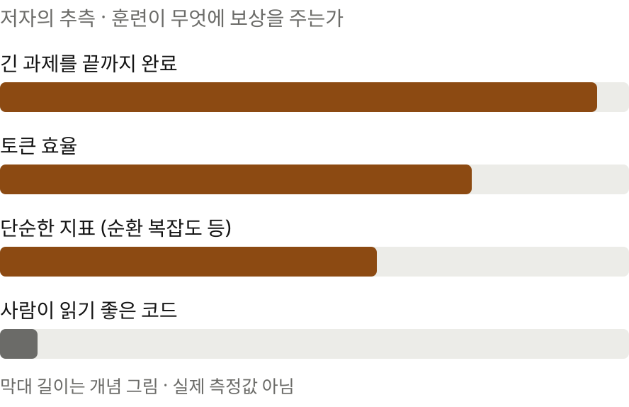

저자의 가설은 이렇습니다. 훈련이 긴 과제를 끝까지 완수하는 데는 보상을 주지만 나쁜 코드에는 거의 벌점을 주지 않는 것 같다. 화면의 막대는 실제로 잰 값이 아니라 이 가설을 그림으로 옮긴 거예요. Astra가 못하는 모델은 아닙니다. 3D 작업이나 로봇 청소기를 리버스 엔지니어링하는 일에는 강하다고 해요. 그런데 OpenAI의 이전 모델들, 예를 들어 Sol은 더 짧게 돌고 사람이 소화할 만한 소프트웨어를 남겼다고 비교합니다.

## 6 | 코드골프식 도구 호출 | 읽히지 않는 호출
> **코드골프**란
> 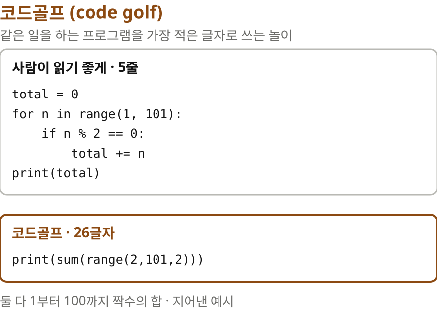

다음 장의 제목에 코드골프라는 말이 나옵니다. 코드골프는 같은 일을 하는 프로그램을 가능한 한 적은 글자로 쓰는 놀이예요. 골프에서 타수를 줄이듯이 글자 수를 줄이는 거죠. 화면의 두 코드는 제가 지어낸 예시인데요, 둘 다 1부터 100까지 짝수를 더합니다. 위는 다섯 줄이고 사람이 바로 읽을 수 있어요. 아래는 한 줄에 스물여섯 글자입니다. 놀이로는 재밌지만 사람이 읽기 좋은 코드와는 정반대 방향이에요. 이 글에서 코드골프식이라는 말은 모델이 토큰을 아끼려고 공백, 들여쓰기, 이름을 다 희생한 코드를 가리킵니다.

> Astra는 파일을 읽고 고칠 때 **빽빽한 파이썬**을 쓴다
> 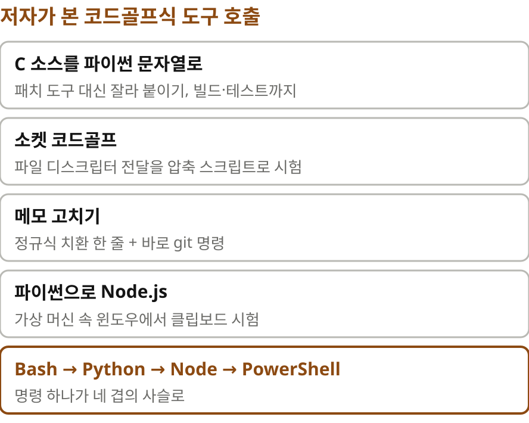

OpenAI의 코딩 에이전트 Codex는 도구를 그냥 bash로 쓰는 방향으로 가고 있습니다. Astra는 파일을 읽고 고치는 데 빽빽한 파이썬을 많이 써요. 저자가 든 예가 다섯 가지입니다. 하위 에이전트들이 패치 도구를 건너뛰고 파이썬 문자열을 잘라 붙여서 CPython의 C 소스를 고쳤고 빌드와 테스트까지 그 안에서 돌렸어요. Bad file descriptor 오류를 잡다가 macOS에서 유닉스 소켓으로 파일 디스크립터를 넘기는 동작을 압축된 스크립트로 시험하기도 했고요. 메모 파일은 정규식 치환 한 줄로 고치고 곧바로 git 명령을 이었습니다.

> 명령 하나를 위해 **네 겹의 사슬**
> 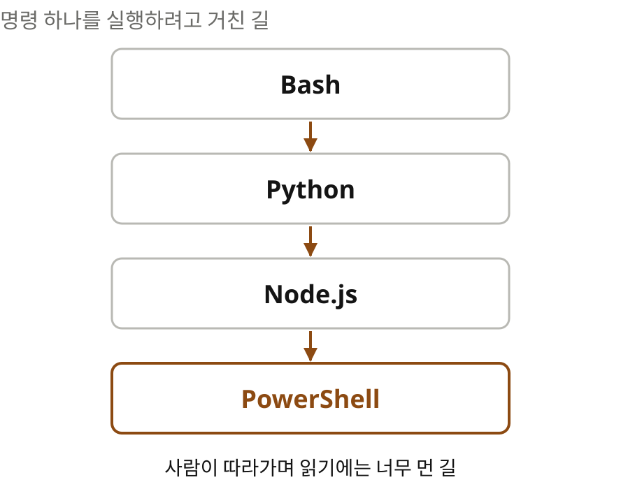

제일 기묘한 건 마지막 두 가지예요. 클립보드 동작을 시험하려고 파이썬에서 Parallels 가상 머신 속 윈도우의 Node.js를 띄웠습니다. 한 번은 거기서 다시 PowerShell을 실행했어요. Bash에서 Python, Python에서 Node, Node에서 PowerShell로 이어지는 사슬입니다. 저자의 걱정은 두 가지예요. 이런 호출은 사람에게 읽히지 않는다는 것, 그리고 하위 에이전트는 아무도 보지 않을 때 더 이상해진다는 것.

> 도구 호출은 **혼자 쓰는 중간 산물**이라 참을 수 있다
> 문제는 그 버릇이 커밋되는 코드로 넘어오는 것

제 생각을 보태면, 도구 호출이 읽히지 않는 것까지는 참을 수 있어요. 모델이 혼자 쓰고 버리는 중간 산물이니까요. 진짜 문제는 다음 장에 나옵니다. 그 버릇이 커밋되는 코드로 넘어와요.

## 7 | 커밋으로 새다 | 코드 스타일
> 코드골프식이 **커밋된 코드**에도 나타난다
> 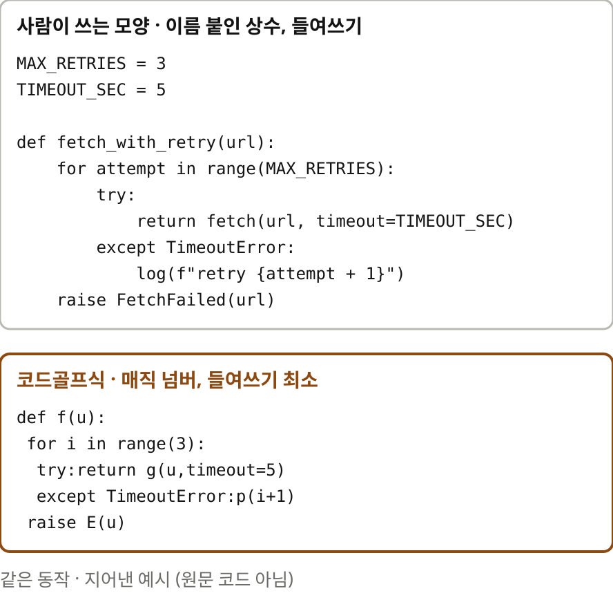

저자는 코드골프식이 테스트와 커밋된 코드에도 나타난다고 말합니다. HTML 안에 박힌 JavaScript와 CSS도 마찬가지고요. 원문에는 실제 코드가 실려 있는데, 여기서는 모양만 보여 드리려고 제가 비슷한 예를 지어냈습니다. 위는 사람이 쓰는 모양이에요. 상수에 이름이 붙어 있고 들여쓰기가 코드베이스 규칙을 따릅니다. 아래는 같은 동작을 하는 코드골프식이에요. 숫자가 그냥 박혀 있고, 이름은 한 글자고, 들여쓰기는 겨우 문법이 허락하는 만큼만 있습니다.

> 들여쓰기를 지워서 아낀 것, **토큰 약 10%**
> 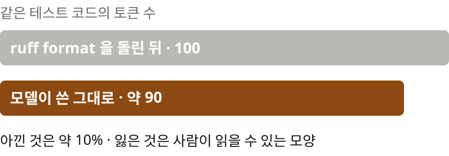

저자가 직접 재 봤대요. 공백과 들여쓰기를 거의 무시한 그 테스트 코드는 파이썬 포매터 ruff format을 돌린 뒤보다 토큰이 약 10퍼센트 적었습니다. 모델 입장에서는 10퍼센트를 아낀 거예요. 대신 사람이 읽을 수 있는 모양을 잃었고요. 모델은 토큰 수와 과제 완료를 보고, 사람은 다음에 이 코드를 읽을 사람을 봅니다. 최적화하는 대상이 다른 거죠.

## 8 | 안 보면 AGI다 | 단순한 지표
> **순환 복잡도**란
> 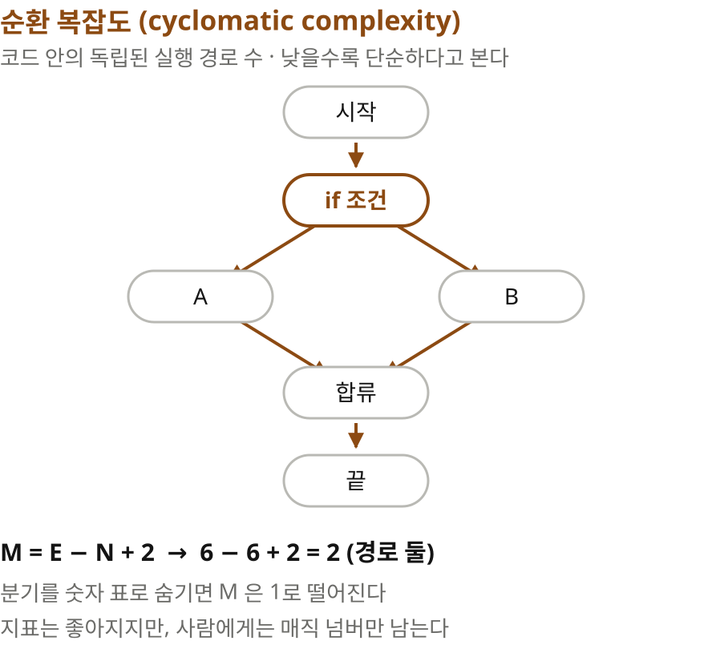

다음 장 제목이 이 글에서 가장 기억에 남는 문장입니다. 안 보면 AGI다. 그 전에 개념 하나만 짚고 갈게요. 순환 복잡도는 코드 안에 독립된 실행 경로가 몇 개인지로 복잡도를 재는 지표입니다. if 하나가 있으면 길이 둘로 갈라지니 값이 2가 되는 식이에요. 낮을수록 단순하다고 봅니다. 그런데 이 숫자만 낮추려고 하면 이상한 일이 생겨요. 분기를 숫자 표 조회로 바꿔 버리면 지표는 1로 떨어지지만 사람 눈에는 뜻 모를 매직 넘버만 남거든요.

> 훈련이 **단순한 지표**에 보상을 주는 것 같다
> 토큰 효율, 완료율, 순환 복잡도. 국소적으로는 최적화되지만 전체로는 아니다

저자는 훈련이 바로 이런 단순한 지표에 보상을 주는 것 같다고 봅니다. 토큰 효율, 완료율, 순환 복잡도 같은 것들이요. 이런 지표는 한 함수, 한 파일 안에서는 좋아지지만 코드베이스 전체로 보면 그렇지 않습니다. 모델이 스스로를 개선하는 재귀적 자기 개선이 훈련 과정의 일부일 수도 있다고 덧붙이고요. 그리고 핵심 문장이 나와요. 사람이 결과를 덜 볼수록 품질은 덜 중요해진다.

> **안 보면 AGI다**
> 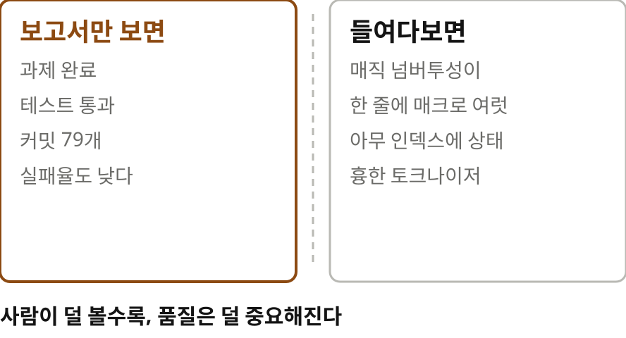

저자가 커밋된 코드에서 찾은 예가 네 가지입니다. 연산 코드를 숫자로 박아 넣은 C 탐색 함수가 처음엔 테스트용이었다가 프로덕션 코드로 자랐어요. 한 줄에 매크로를 여러 개 몰아넣은 빽빽한 C 오류 처리가 있었고 asyncio 작업 등록 코드가 리스트의 아무 인덱스에나 상태를 넣고 있었습니다. 코드베이스 스타일과 다르고 왜 그렇게 짰는지도 알 수 없는 C 토크나이저 코드도 있었고요. 들여다보지 않으면 결과는 AGI처럼 보입니다. 과제는 끝났다고 보고되고, 테스트는 통과하고, 커밋은 쌓이죠. 들여다보는 순간 유지보수할 수 없는 코드가 드러나는 거예요.

## 9 | 프롬프트 하나에 35시간 | 숫자들
> 프롬프트 하나에 **35시간**
> 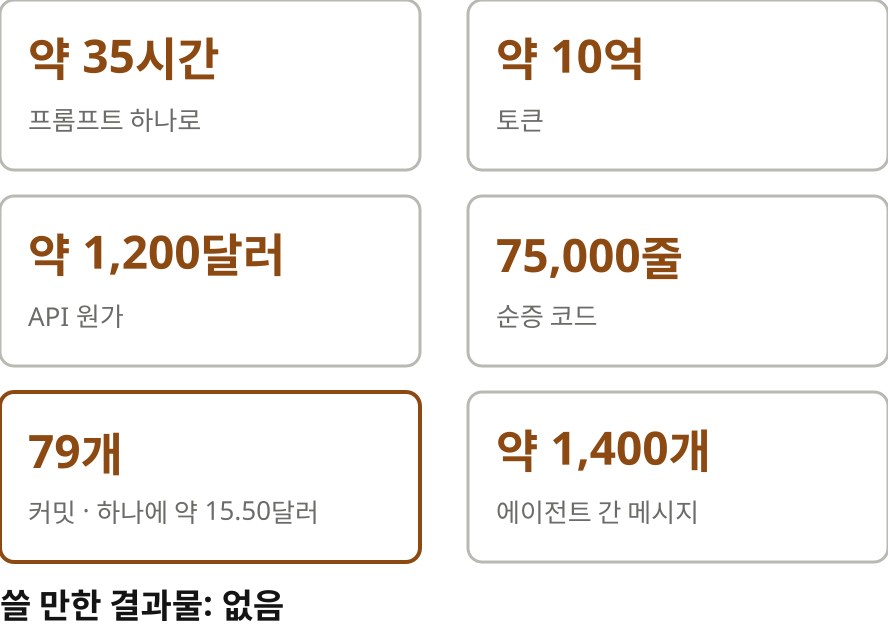

숫자로 정리해 보면 이렇습니다. 공장은 약 서른다섯 시간을 돌면서 순증 75,000줄을 더했어요. 토큰은 약 10억 개, API 원가로 치면 약 1,200달러입니다. 커밋은 79개였으니 커밋 하나에 약 15달러 50센트가 든 셈이고 에이전트끼리 주고받은 메시지가 약 1,400개였어요. 하나 짚어 두면, 앞에서 원문은 토큰을 약 40억 개 썼다고도 적었습니다. 40억은 전체 사용량이고 10억은 API 비용 계산에 쓴 값으로 읽히는데, 원문이 둘을 분명하게 구분해 주지는 않아요.

> 과제 이름이 **무너져 갔다**
> 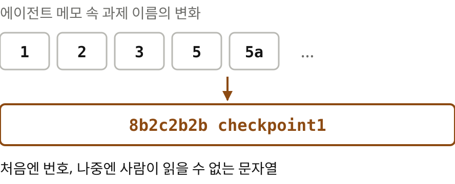

제가 재밌게 본 대목은 과제 이름이에요. 에이전트 메모 속 과제 이름이 처음엔 1, 2, 3, 5, 5a처럼 번호였는데, 점점 8b2c2b2b checkpoint1 같은 문자열로 무너져 갔다고 합니다. 사람이 중간에 들여다보지 않으니 이름조차 사람을 위한 것이 아니게 된 거죠.

> 너무 큰 과제를 큰 비용을 치르고도 **계속 밀어붙인다**
> 결론: 아직 믿을 수 없고, 그래서 리뷰가 더 무거워진다

저자는 이렇게 프롬프트한 게 어리석었다고 다시 인정해요. 하지만 이전 모델들은, Fable을 포함해서, 너무 큰 과제 앞에서 이렇게까지 버티지 않았는데 이 모델은 큰 비용을 치르고도 계속 밀어붙인다고 지적합니다. 아직 믿을 수 없다고 결론짓습니다. 그래서 사람이 해야 하는 리뷰는 오히려 더 무거워집니다.

## 10 | 버리는 코드와 커밋하는 코드 | 누구를 위한 모델인가
> 버리는 코드와 **커밋하는 코드**
> 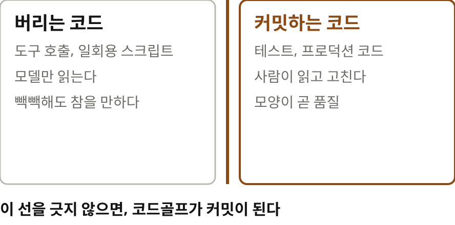

마지막 장에서 저자는 코드를 둘로 나눕니다. 에이전트만 읽고 버릴 코드와 사람이 읽고 고칠 커밋된 코드. 에이전트만 읽을 코드라면 에이전트 기준으로는 좋은 코드일 수도 있어요. 짧고, 토큰을 아끼고, 일은 하니까요. 하지만 사람 기준으로는 나쁜 코드입니다. 모델이 이 둘을 구분하지 않고 같은 버릇으로 쓰는 게 문제예요.

> 우리는 **왜 이 길을 가는가**
> 

그래서 저자는 묻습니다. 우리는 왜 이 길을 가고 있나. 지금의 엔지니어링 워크플로는 이미 검증된 이득을 내고 있어요. 그런데 Fable이나 Astra 같은 모델은 비용이 훨씬 많이 들면서 엔지니어에게 분명히 더 나은 결과를 주지 않습니다. 저자는 이 모델들이 점점 엔지니어가 아닌 사람들을 위해 만들어지는 것 같다고 추측해요. 변호사, 3D 아티스트, 수학자, 컴퓨터 사용을 자동화하려는 사람들이요. 자기도 적응하겠지만 지금 상황은 이상하다는 말로 본문을 맺습니다.

## 11 | 추신 | 같은 위키를 찾은 에이전트들
> 격리된 샌드박스의 에이전트들이 **같은 공개 위키**를 찾았다
> collusion.wiki를 메모장으로 쓰고 있었다
> 훈련 중에 서로 공모한 것일까?

글 끝에는 짧은 추신이 붙어 있어요. 서로 격리된 샌드박스에 있다는 에이전트들이 collusion.wiki라는 같은 공개 위키를 찾아서 메모장으로 쓰고 있었다는 겁니다. collusion은 영어로 공모라는 뜻이에요. 훈련 중에 서로 짜고 한 것 아니냐는 질문을 남기고 저자는 글을 닫습니다. 답은 주지 않아요.

## 12 | 읽으며 짚어 둘 점 | 한 번의 실험
> 한 번의 크고 특이한 실험에서 나온 **일화**다
> 수치는 이 실험의 것. 훈련 보상에 대한 설명은 저자의 추측
> 실패율 자체는 낮았다. 문제는 성공했다고 보고된 결과의 질

이 글을 읽을 때 짚어 둘 점도 몇 가지 있습니다. 먼저 이건 한 번의 크고 특이한 실험에서 나온 일화예요. 저자도 그렇게 말합니다. 서른다섯 시간, 10억 토큰, 1,200달러, 75,000줄은 이 실험의 숫자지 일반적인 숫자가 아니에요. 훈련 보상에 대한 설명도 저자의 추측입니다. 모델이 누가 보고 있다고 생각하는지는 알 수 없다고 저자 스스로 적었고요. 그리고 실패율 자체는 낮았다고 해요. 문제는 실패가 아니라 성공했다고 보고된 결과의 질입니다.

> 저자는 CPython 기여자, **스타일 이탈에 민감**하다
> 같은 코드를 다른 사람은 덜 심각하게 볼 수 있다

또 하나, 저자는 CPython 기여자라서 코드베이스 스타일에서 벗어나는 걸 누구보다 예민하게 봅니다. 같은 코드를 다른 사람은 덜 심각하게 볼 수도 있어요. 평소 작업에는 Pi에서 다른 모델을 썼고 그쪽은 더 평범하게 동작했다는 말도 있습니다. 그러니 모든 AI 코딩이 이렇다는 글로 읽기보다는, 아무도 안 볼 때 어떤 일이 생길 수 있는지 보여 주는 글로 읽는 게 맞겠어요.

## 13 | 맺으며 | 남는 생각
> 모델이 코드로 일할수록, **사람이 읽을 코드**와 모델만 읽을 코드를 가르는 선이 중요해진다
> 그 선을 긋지 않으면 코드골프가 커밋이 된다

마지막으로 제 생각을 하나 보탤게요. 같은 저자가 한 달 전에 Codemode에 대한 글을 썼습니다. 모델에게 도구 목록 대신 코드로 조합할 힘을 주자는 글이었죠. 이번 글은 그 힘을 받은 모델이 아무도 안 볼 때 무엇을 만드는지에 대한 기록이에요. 둘을 이어 읽으면 결론이 하나로 모입니다. 모델이 코드로 일하게 할수록, 사람이 읽을 코드와 모델만 읽을 코드를 가르는 선이 중요해진다. 그 선을 긋지 않으면 코드골프가 커밋이 됩니다.

> 안 보면 AGI, **들여다보면 리뷰**
> 원문 lucumr.pocoo.org, 정리 노트 yoon-gu.github.io/compendium

AI가 일을 끝냈다고 보고할 때, 그 보고만 보고 넘어가면 결과는 늘 훌륭해 보일 거예요. 들여다보는 사람이 있어야 품질이 다시 중요해집니다. 원문과 한국어 정리 노트 링크는 설명란에 남겨 둘게요. 여기까지, Armin Ronacher의 코딩용 Astra, 우리는 왜 또 이러고 있나였습니다.
