# AI 시대의 커리어 조언 — 나레이션 대본

필 첸(Phil Chen)의 "Career advice in the age of AI"(X 아티클, 2026-07-02)를 한 사람이 들려주듯 풀어 쓴 대본.
원문 번역이 아니라 [정리 노트](../../content/notes/career-advice-in-the-age-of-ai.md)를 바탕으로 요지를 다시 서술한 것이다.

형식은 `../build.py` 머리말 참고. `python3 ../build.py career-advice-in-the-age-of-ai --voice=유나`로 굽는다(세로 1080x1920). 그림은 `figures/make.py`.

출처: 필 첸, 〈Career advice in the age of AI〉 2026년 7월
잉크: #B0472D
약어: xG=expected goals, 기대 득점; ASI=Artificial Superintelligence, 초지능; LLM=Large Language Model, 거대 언어 모델

## 1 | 들어가며 | 표지
> AI 시대의 / 커리어 조언
> 필 첸, Career advice in the age of AI, X 아티클, 2026년 7월
> OpenAI·DeepMind·Scale AI를 거쳐 창업한 사람이 사회 초년생에게 주는 여섯 가지 조언

AI가 코드를 다 써 주는 시대에 막 일을 시작하는 사람은 무엇을 준비해야 할까요? 오늘 소개할 글은 그 질문에 대한 한 창업자의 답입니다. Scale AI, Google DeepMind, OpenAI를 거쳐 지금은 에이전트 네이티브 스타트업을 차린 필 첸이 2026년 7월에 X에 올린 글인데요. 채용을 하면서 느낀 것을 바탕으로 의욕 있는 사회 초년생에게 여섯 가지 조언을 건넵니다. 글의 흐름을 따라가면서 제 생각도 조금씩 보태 보겠습니다.

## 2 | 출발점 | 손실 함수
> 모델은 **손실 함수**를 쓸 수 있는 일이면 점점 잘하게 된다
> 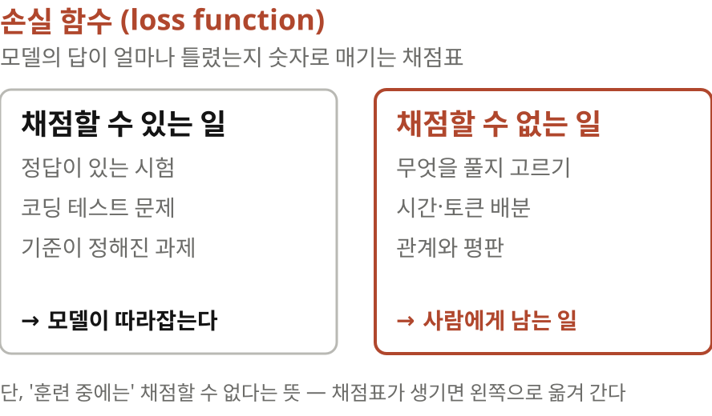

글은 한 문장에서 출발합니다. AI 모델은 손실 함수를 쓸 수 있는 일이면 무엇이든 점점 잘하게 된다. 손실 함수는 모델의 답이 얼마나 틀렸는지 숫자로 매기는 채점표라고 생각하시면 돼요. 채점표가 있으면 모델은 그 점수를 올리는 쪽으로 학습합니다. 그런데 학교 공부는 대부분 정답이 정해진 문제를 채점하는 일이죠. 시험도, 코딩 테스트도 손실 함수로 쓸 수 있어요.

> 앞으로 10년의 값진 일은 **훈련 중에 채점할 수 없는** 모든 것
> 무엇을 풀지 고르기, 시간과 토큰을 어디에 쓸지 정하기, 관계와 평판
> 다만 '훈련 중에'라는 단서가 붙는다. 누가 채점 방법을 만들면 같은 운명이 된다

그래서 저자의 결론은 이렇습니다. 앞으로 10년 동안 값진 일은 모델을 훈련하는 동안 채점할 수 없는 모든 것이다. 데이터 일을 하는 분이라면 익숙한 논리예요. 정답 레이블이 있고 자동 채점이 되는 과제는 결국 학습 목표가 되고, 학습 목표가 된 과제는 모델이 따라잡습니다. 다만 저는 '훈련 중에'라는 단서를 기억해 두고 싶어요. 지금 채점할 수 없는 일도 언젠가 누가 채점 방법을 만들면 같은 운명이 된다는 뜻이니까요.

## 3 | 배경 | 에이전트 네이티브 회사
> 아무도 코드를 **손으로 한 줄도** 쓰지 않는 회사
> 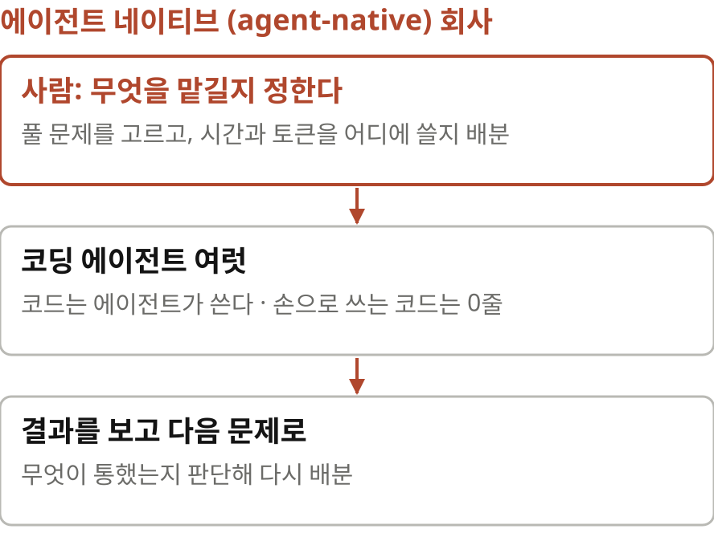

저자는 자기 회사를 에이전트 네이티브 회사라고 부릅니다. 아무도 코드를 손으로 한 줄도 쓰지 않는다는 거예요. 엔지니어는 코딩 에이전트에게 일을 맡기고 사람은 무엇을 맡길지, 시간과 토큰을 어디에 쓸지 정합니다. 이 글의 조언은 모두 이런 회사가 어떤 사람을 뽑고 싶어 하느냐에서 나와요.

> 직원 15명 회사부터 **10만 명** 넘는 회사까지
> 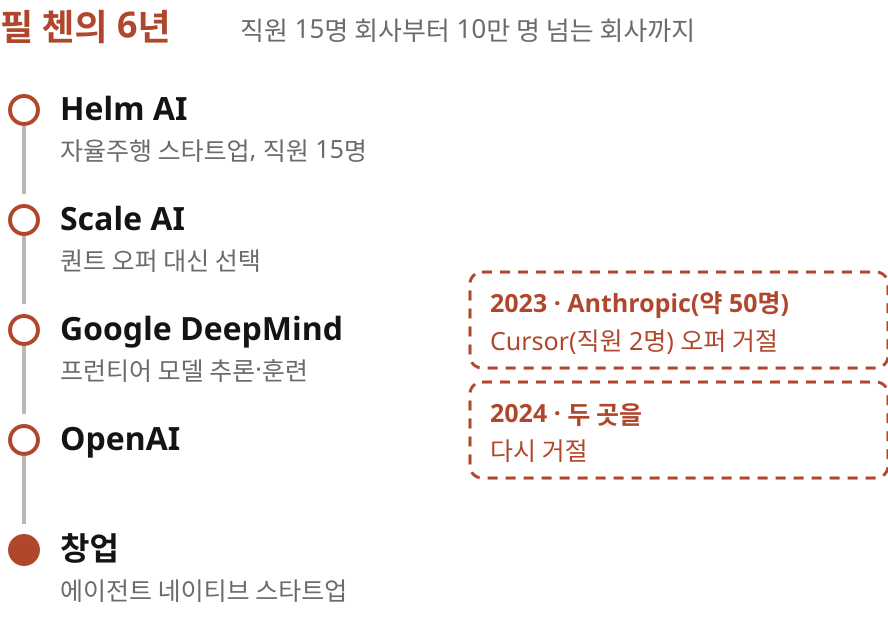

저자는 6년 동안 직원 열다섯 명의 자율주행 스타트업 Helm AI부터 십만 명이 넘는 Google까지 여러 규모의 회사에서 일했습니다. 로켓에 자리가 나면 어느 자리냐고 묻지 말고 타라 같은 오래된 격언은 여전히 맞대요. 하지만 에이전트 코딩이 많은 것을 바꿨으니 무엇이 그대로고 무엇이 새로운지 나눠 보겠다고 합니다.

## 4 | 첫째 조언 | 희소한 자원
> 정말 **희소한 자원**에 집중하라
> 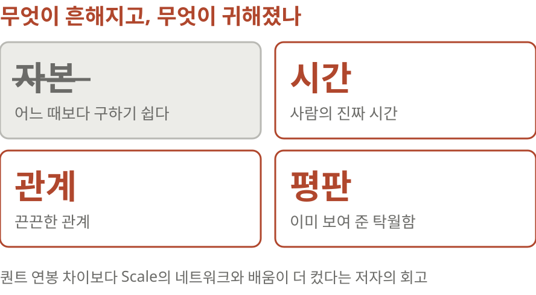

첫 번째 조언은 정말 희소한 자원에 집중하라는 겁니다. Scale AI에 가기 전 저자에게는 보장 연봉이 훨씬 높은 퀀트 회사 오퍼들이 있었어요. 그래도 공동체가 좋았고 여러 제품과 응용을 두루 볼 수 있어서 Scale을 택했습니다. 거기서 LLM 업체들을 접한 것이 DeepMind와 OpenAI로 이어졌고 그때 만난 동료들은 지금 창업자 공동체가 됐대요. 퀀트로 갔을 때 더 받았을 돈보다 네트워크와 배움이 삶에 훨씬 많이 기여했다는 회고입니다.

> 자본은 흔해졌고, **시간·관계·평판**은 여전히 드물다
> 이미 보여 준 탁월함이 여전히 가장 강한 신호
> 시간을 가차 없이 배분해 의미 있다고 느끼는 문제에 쓸 것

지금은 자본을 구하기가 어느 때보다 쉽다고 해요. 반면 사람의 진짜 시간과 끈끈한 관계는 여전히 드뭅니다. 관련된 일에서 이미 보여 준 탁월함이 가장 강한 신호이니 좋은 일을 하고 그 일을 평판 좋은 사람들에게 알리라고 합니다. 바이브 코딩으로 쉽게 돈 버는 기회는 찾기 쉬워졌지만 진짜 가치를 찾을 때 보상이 대개 훨씬 크다고요.

> 만드는 일이 싸지면 **믿어 줄 사람**의 값이 오른다
> 다만 퀀트를 거절해서 잘됐다는 것은 사후적인 이야기다

제 생각을 보태면, 코드 만드는 비용이 무너진 지금 이 말은 무게가 다릅니다. 만드는 일이 싸지면 만든 것을 믿어 줄 사람, 그러니까 평판의 값이 오르죠. 다만 퀀트를 거절한 결과가 좋았다는 건 사후적인 이야기예요. 같은 선택을 하고 잘 안 된 사람의 글은 우리가 읽을 일이 없으니까요.

## 5 | 둘째 조언 | 문제 찾기
> 문제를 푸는 것만큼 **찾는 법**을 익혀라
> 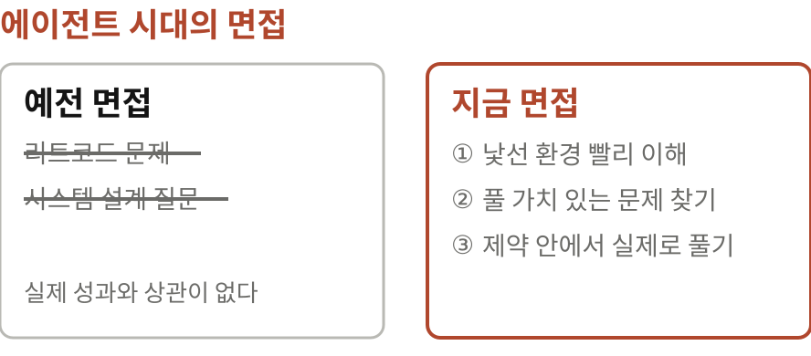

두 번째 조언은 문제를 푸는 것만큼 찾는 법을 익히라는 겁니다. 저자의 회사는 면접을 다시 설계했어요. 아무도 코드를 손으로 쓰지 않으니 리트코드 식 알고리즘 문제는 물론 시스템 설계 질문까지 실제 업무 성과와 상관이 없어 보였대요. 그렇게 정한 면접은 이렇습니다. 낯선 환경에 놓였을 때 얼마나 빨리 이해하는가, 풀 가치가 있는 문제를 찾아내는가, 그리고 기존 환경의 제약 안에서 그 문제를 실제로 풀어내는가.

> 같은 에이전트, **다른 비용**
> 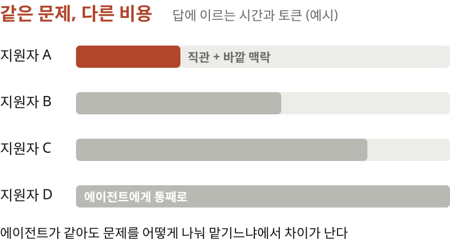

에이전트가 과제를 다 풀어 버려서 의욕을 잃는 학생이 많다고 해요. 그런데 면접을 해 보면 지원자마다 답에 이르기까지 드는 시간과 토큰이 크게 다르답니다. 뛰어난 지원자는 에이전트와 일할 때 높은 수준의 직관과 바깥 맥락을 가져온대요. 높게 평가받은 사람들은 좋아서 하는 프로젝트든 고성장 회사든, 문제를 푸는 환경에 푹 잠겨 본 사람들이었다고 합니다.

> 엔지니어링은 **할당 문제**가 되었다
> 가장 중요한 역량은 문제 선정과 자원 배분
> 분석 일로 옮기면, 쿼리를 짜는 능력보다 어떤 질문을 데이터에 던질지가 더 비싸진다

저자는 이 경험 덕분에 오히려 일자리에 희망이 생겼다고 따로 적었어요. 에이전트가 이미 여러 면에서 초인적인데도 사람마다 성과 차이가 크다는 건, 사람의 능력이 에이전트를 어떤 문제에 얼마나 배분하느냐로 옮겨 가도 여전히 사람마다 다르다는 뜻이니까요. 엔지니어링이 할당 문제가 됐다는 표현이 이 대목의 핵심입니다. 분석 일로 옮기면 쿼리를 짜는 능력보다 어떤 질문을 데이터에 던질지가 더 비싸진다는 이야기와 같아요.

## 6 | 셋째 조언 | 야심 찬 문제
> **쓴 교훈**: 범용 방법을 키우는 쪽이 결국 이긴다
> 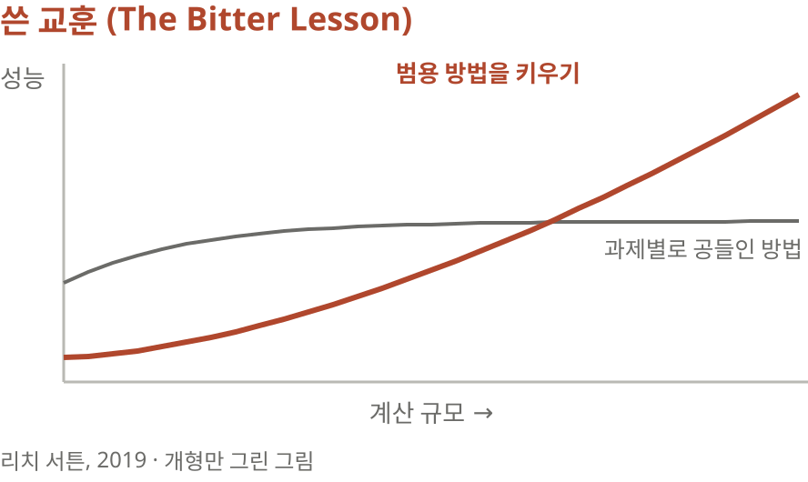

세 번째 조언은 가장 야심 찬 형태의 문제를 고르라는 겁니다. 저자는 지난 10년 연구에서 가장 쓸모 있던 사고 틀로 쓴 교훈, The Bitter Lesson을 꼽아요. 강화학습 연구자 리치 서튼이 2019년에 쓴 짧은 글인데, 사람의 지식을 정교하게 짜 넣은 방법보다 계산을 늘리면 좋아지는 범용 방법이 결국 이긴다는 주장입니다. 저자는 이 교훈이 문제와 회사를 고를 때도 통한다고 봐요. 지금 모델의 빈틈을 메우는 작은 문제는 다음 세대 모델이 지워 버리니까요.

> 결과는 늘 **멱법칙**을 따랐고, AI가 쏠림을 가속했다
> 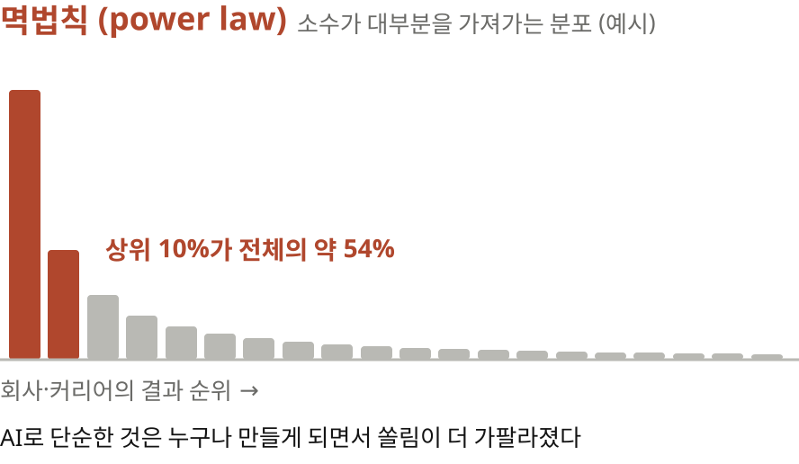

회사와 커리어의 결과는 늘 멱법칙을 따랐습니다. 소수가 대부분을 가져가는 분포죠. 그런데 AI가 이 쏠림을 더 가파르게 만들었대요. 소프트웨어 만들기가 쉬워져서 누구나 단순한 시스템은 비교적 쉽게 만들거든요. 오래가는 가치는 정말 야심 찬 문제에 극도로 집중할 때만 생긴다는 겁니다.

> 회사는 **가장 야심 찬 형태**를 풀고 있는가, 직무는 **최전선**에 있는가
> 그리고 실제로 풀 가능성이 있는가

그래서 회사를 고르는 기준은 단순합니다. 그 회사가 자기 문제의 가장 야심 찬 형태를 풀고 있는지, 실제로 풀 가능성이 있는지를 봅니다. 직무를 고를 때는 그 자리가 회사가 푸는 문제의 최전선에서 직접 일하게 해 주는지를 보고요.

## 7 | 넷째 조언 | 마지막 10%
> 마지막 구간을 **전력으로** 달려라
> 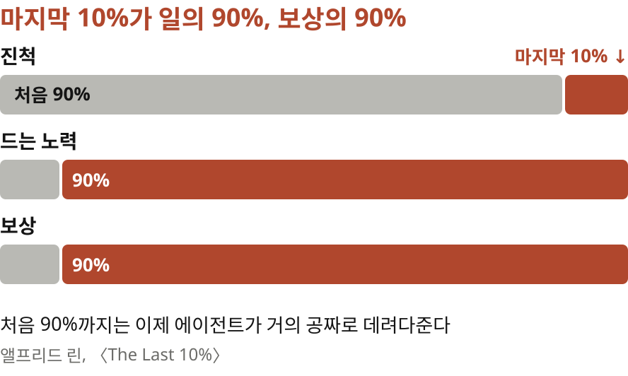

네 번째 조언은 마지막 구간을 전력으로 달리라는 겁니다. 저자는 Sequoia Capital의 파트너 앨프리드 린의 글을 인용해요. 마지막 10퍼센트가 일의 90퍼센트이면서 보상의 90퍼센트라는 거죠. 린은 원래 파레토 법칙, 그러니까 20퍼센트의 노력으로 80퍼센트의 결과를 낸다는 말이 창업에는 맞지 않는다고 주장했어요. 스타트업 대부분이 망하니 80퍼센트짜리 결과는 0이 가득한 분포의 중간값일 뿐이라는 겁니다.

> 대충 쓴 프롬프트의 결과가 **곧 중간값**이 되었다
> 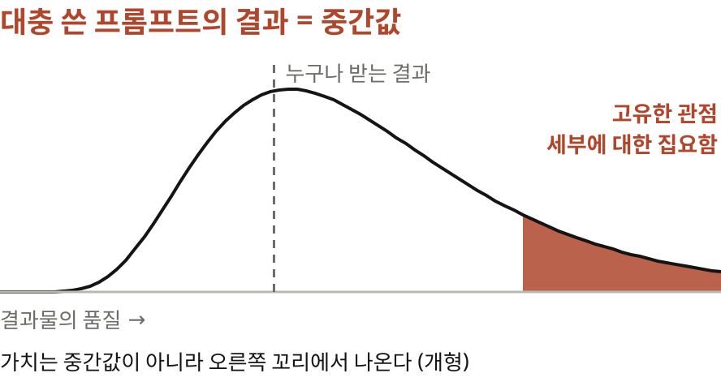

저자는 여기에 AI를 얹습니다. AI는 결과를 양극화했어요. 대충 쓴 프롬프트로 에이전트가 내놓는 것이 곧 중간값이 되었거든요. 80퍼센트까지는 이제 에이전트가 거의 공짜로 데려다주니 사람이 돈을 받는 구간은 나머지밖에 남지 않습니다. 가치는 문제의 한 조각에 대한 고유한 관점이나 세부에 대한 집요함에서 나온다고 해요.

> 배운 것만 챙겨 **다음 세대 모델로 처음부터** 다시
> 다듬기, 깔끔한 구조, 확장성, 창의성에 조금 더 시간을 쓰는 주도성
> 코드를 자산이 아니라 소모품으로 보는 관점

마지막 구간은 대개 반복입니다. 그런데 코딩 에이전트가 워낙 빨리 발전해서 이전 반복에서 배운 것만 챙기고 다음 세대 모델로 아예 처음부터 다시 시작하는 편이 나을 때가 많대요. 저는 이 대목이 흥미로웠어요. 이전 결과물에 매달리지 말고 배움만 들고 가라는 것, 코드를 자산이 아니라 소모품으로 보는 관점이니까요. 자기 프로젝트로 연습하면서 다듬기와 깔끔한 구조, 확장성에 조금 더 시간을 쓰는 사람에게서 차이가 분명히 보였다고 합니다.

## 8 | 다섯째 조언 | xG와 결정력
> 축구의 **xG**, 기대 득점
> 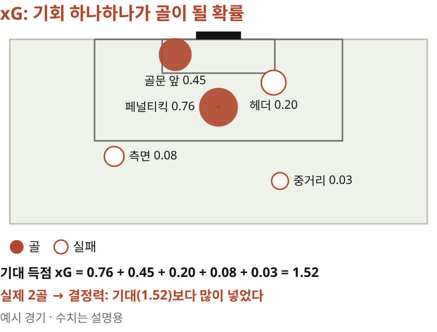

다섯 번째 조언에는 축구 비유가 나옵니다. xG, 기대 득점이라는 지표가 있어요. 슈팅 하나하나를 거리와 각도, 골키퍼 위치로 따져 골이 될 확률을 매기고 그걸 더한 값입니다. 페널티킥은 0.76쯤, 먼 거리 중거리 슛은 0.03쯤 되는 식이죠. 그림의 예시 경기에서는 기회를 다 더하면 1.52골이 기대되는데 실제로는 두 골을 넣었어요. 이렇게 기회를 실제 골로 바꾸는 힘이 결정력입니다.

> 2023년, **Anthropic과 Cursor**의 오퍼를 거절했다
> Anthropic은 당시 직원 약 50명, Cursor는 창업자 외 직원 2명
> 2024년에는 OpenAI에 가려고 두 곳을 다시 거절

저자는 이 비유가 자기 커리어에 꽤 들어맞았다고 해요. 2023년 저자는 직원이 쉰 명쯤이던 Anthropic과, 창업자 말고 직원이 두 명뿐이던 Cursor의 오퍼를 거절했습니다. DeepMind에서 프런티어 모델의 추론과 훈련을 하고 싶었거든요. 2024년에는 OpenAI에 가려고 두 곳을 다시 거절했습니다. 둘 다 xG가 높은 기회였지만 자기 관심사와 문화, 그리고 목표에 더 맞는 곳을 골랐대요. 목표의 영어가 골이라 말장난이라고 덧붙이고요.

> 기회가 보이는 자리에 서는 것이 **득점의 첫걸음**
> 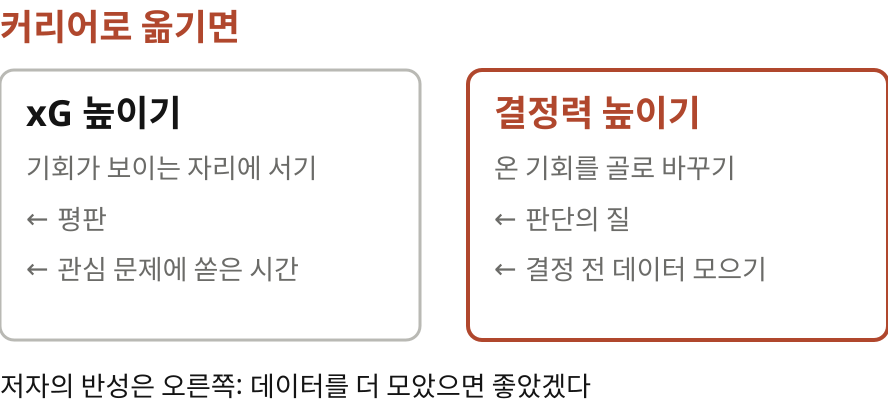

모든 기회가 골이 되지는 않습니다. 하지만 기회가 보이는 자리에 서 있는 것이 득점의 첫걸음이고, 이것도 평판과 전문성의 문제래요. Cursor의 기회는 공동 창업자들과 겹치는 지인들 사이에서 평판이 좋았기 때문에 왔고 Anthropic의 기회는 그 팀이 관심 두던 문제에 시간을 쏟아 왔기 때문에 왔습니다. 그리고 어느 시점부터 삶은 골을 넣는 일이니 결정력도 중요하다고 해요. 저자는 결정 전에 데이터를 더 모았으면 좋았겠다고 돌아봅니다.

> 제품이 아니라 **팀과 시장**을 보라
> Anthropic의 첫 데모는 ChatGPT보다 못한 슬랙봇이었다
> 저자는 ASI가 와도 문제를 고르고 자본을 배분하는 사람의 몫은 남는다고 본다

초기 스타트업을 고를 때의 핵심은 팀과 시장이라고 합니다. 많은 지원자가 지금의 제품을 기준으로 보지만 팀이 좋으면 제품은 거의 항상 전혀 다른 것으로 바뀌거든요. 저자가 보기에 Anthropic의 첫 데모는 ChatGPT보다 못한 슬랙봇이었대요. 이 절은 조언이면서 고백입니다. 엄청난 기회를 두 번씩 거절하고도 결론은 더 좋은 기회를 잡으라가 아니라 자리에 서기와 판단의 질로 나뉘어요. 저는 그 점이 흥미로웠어요. 저자는 초지능이 와도 의미 있는 문제를 고르고 거기에 자본을 배분하는 능력에서 사람의 몫이 남는다고 봅니다.

## 9 | 여섯째 조언 | 연구에 뛰어들기
> 지금은 **연구**에 뛰어들 수 있다
> 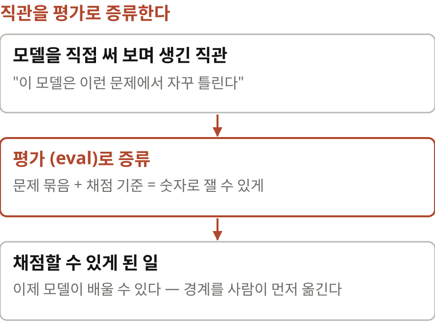

마지막 조언은 지금은 연구에 뛰어들 수 있다는 겁니다. 요즘 연구는 컴퓨트가 많을수록 하기 쉽지만 시작하기 좋은 곳은 모델을 직접 써 보며 자기 직관을 평가로 증류하는 일이래요. 이 모델은 이런 문제에서 자꾸 틀린다는 감을 문제 묶음과 채점 기준으로 바꾸는 겁니다. 저는 이 말이 첫 문단의 손실 함수 이야기와 맞물린다고 봤어요. 채점할 수 없던 영역에 채점 방법을 처음 만드는 사람이 연구자라는 뜻으로 읽히거든요.

> 연구자는 직업이 아니라 **태도**
> 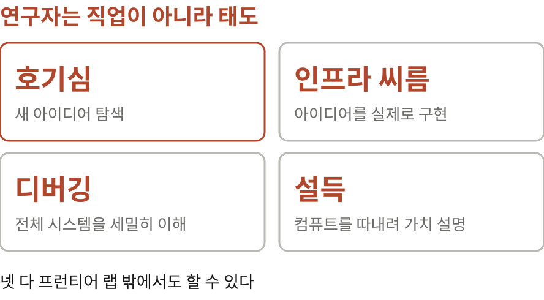

예전 동료 켈러 조던이 알린 공개 학습 속도 경쟁 리더보드도 아이디어를 탐색하기 좋은 무대라고 해요. Modal 같은 컴퓨트 업체가 학계에 주는 크레딧을 받아 지금 아이디어를 시험해 보라고요. 대부분의 아이디어는 규모를 키우면 실패하는데, 그 실패를 이해하는 것이 무엇이 통하는지 이해하는 첫걸음이래요. 저자는 연구자가 직업이 아니라 태도라고 믿습니다. 호기심, 인프라와의 씨름, 시스템 전체를 세밀하게 이해하는 디버깅, 그리고 컴퓨트를 더 받으려고 결과의 가치를 설명하는 일. 이 넷은 프런티어 랩 밖에서도 할 수 있다고요. 마지막 것은 회사에서 GPU나 예산을 받아 본 분이라면 바로 와닿으실 거예요.

## 10 | 짚어 둘 점 | 한쪽 관점
> 채용하는 창업자가 쓴 **한쪽 관점**의 글
> 근거는 대부분 저자 개인의 경력과 자기 회사 면접. 면접 내용은 공개되지 않았다
> "자본은 쉽고 관계가 희소하다"는 업계 최상단에서 보이는 풍경

읽으면서 짚어 둘 점도 있어요. 이 글은 채용하는 창업자가 썼고 끝에 함께 일하자는 제안이 붙어 있습니다. 조언이 자기 회사가 원하는 인재상과 겹치는 건 자연스럽지만 그만큼 한쪽 관점이에요. 근거도 대부분 저자 개인의 경력과 자기 회사 면접 경험이고, 해킹할 수 없다고 자신하는 그 면접의 내용은 공개되지 않았습니다. 자본은 쉽고 관계가 희소하다는 진단도 Scale, DeepMind, OpenAI처럼 업계 최상단에서 보이는 풍경이고요. 아무도 코드를 손으로 쓰지 않는다는 것도 저자 회사의 이야기지 모든 조직이 이미 그렇다는 뜻은 아닙니다.

## 11 | 맺으며 | 남는 생각
> AI는 답을 주지만 **질문은 대신 골라 주지 않는다**
> 무엇을 풀지 고르기, 시간과 토큰을 어디에 쓸지 정하기, 마지막 10%를 끝까지 다듬기
> 원문 x.com/philhchen
> 정리 노트 yoon-gu.github.io/compendium

정리하면 첫 문단의 한 문장이 글 전체를 끌고 갑니다. 손실 함수를 쓸 수 있는 일은 모델 차지가 된다. 그러니 사람에게 남는 일은 무엇을 풀지 고르는 일, 시간과 토큰을 어디에 쓸지 정하는 일, 그리고 마지막 10퍼센트를 끝까지 다듬는 일입니다. 앞서 소개한 AI 시대의 매니저의 길이 AI는 가시성은 주지만 이해는 대신해 주지 않는다고 했다면, 이 글은 AI는 답을 주지만 질문은 대신 골라 주지 않는다고 말하는 셈이에요. 다만 그 질문 고르기조차 언젠가 누가 채점 방법을 만들면 모델의 일이 될 수 있겠죠. 직관을 평가로 증류하라는 권유는 그 경계를 사람이 먼저 옮기라는 말로도 읽힙니다. 여기까지, 필 첸의 AI 시대의 커리어 조언이었습니다.
