# Codemode란 무엇인가 — 나레이션 대본

아르민 로나허의 "What is Codemode"(lucumr.pocoo.org, 2026-10-06)를 한 사람이 들려주듯 풀어 쓴 대본.
원문 번역이 아니라 [정리 노트](../../content/notes/codemode.md)를 바탕으로 요지와 해설을 다시 서술한 것이다.

형식은 `../build.py` 머리말 참고. `python3 ../build.py codemode`로 굽는다(세로 1080x1920). 그림은 `figures/make.py`.

출처: 아르민 로나허, 〈What is Codemode〉 2026년 10월
잉크: #1F5F7A
약어: MCP=Model Context Protocol, 에이전트가 외부 도구를 부르는 개방 규격; CLI=Command-Line Interface, 명령줄 프로그램; LLM=Large Language Model, 거대 언어 모델; JSON=JavaScript Object Notation, 구조화된 데이터 형식; WASM=WebAssembly, 샌드박스용 바이너리 형식; API=Application Programming Interface

## 1 | 들어가며 | 표지
> Codemode란 / 무엇인가
> 아르민 로나허, What is Codemode, 2026년 10월
> Flask를 만든 개발자가 자신의 에이전트 하니스 Pi에 넣은 설계

AI 에이전트가 GitHub 이슈 100개를 읽고 가장 화난 사용자 열두 명을 골라야 한다고 해 볼게요. 보통의 에이전트는 이슈 하나를 볼 때마다 모델에게 돌아가 다음에 뭘 할지 묻습니다. 그러면 모델과 백 번 넘게 왕복하고 결과 백 개가 고스란히 쌓이죠. 오늘 소개할 글은 이 문제를 다르게 푸는 방법, Codemode에 관한 이야기입니다. Flask와 Jinja를 만든 Armin Ronacher가 2026년 10월에 쓴 글이에요.

## 2 | 배경 | 저자의 지론
> MCP 서버를 **잔뜩 붙이지 마라**
> 도구 정의는 컨텍스트를 잡아먹고, 모델은 무엇을 쓸지 헷갈린다
> 차라리 스크립트와 CLI를 쓰게 하라

이 글을 이해하려면 저자가 1년 넘게 해 온 말을 먼저 알아야 해요. MCP 서버나 커스텀 도구를 잔뜩 붙이지 말고 차라리 스크립트와 CLI를 쓰게 하라는 겁니다. 이유는 세 가지였어요. 첫째, 도구 정의는 그 자체가 토큰이라 서버 몇 개만 붙여도 수십 개의 도구 설명이 매 요청마다 실립니다. 둘째, 선택지가 많을수록 모델은 엉뚱한 도구를 고르거나 비슷한 도구 사이에서 흔들려요. 셋째, CLI는 서로 이어 붙일 수 있습니다. 작은 프로그램을 파이프로 잇는 법을 모델은 훈련에서 이미 배웠거든요.

> 그런데 Pi 1.0은 **MCP를 지원**한다
> "MCP 쓰지 말라더니 본인이 넣었네?"
> 저자의 답: 지원하는 방식이 다르다

그런데 저자가 만든 하니스 Pi가 1.0을 내면서 MCP를 지원하게 됐어요. 그러니 말과 행동이 다르다는 소리가 나올 법하죠. 저자는 지원하는 방식이 다르다고 답합니다. 그 방식이 Codemode예요. 그 사이 MCP 쪽도 많이 움직였습니다. 도구가 결과의 구조를 미리 선언할 수 있게 됐고, Cloudflare는 모델이 MCP 도구를 코드로 부르게 하는 Code Mode를 내놓았고, Anthropic도 필요한 도구만 찾아 쓰게 하는 접근을 공개했어요. 저자가 말해 온 방향으로 생태계가 다가온 셈입니다. 다만 이 흐름의 세부는 원문이 아니라 정리 노트에서 보탠 배경이라는 점은 밝혀 둘게요.

## 3 | 배경 | 먼저 알아 둘 말
> **도구 호출**이란
> 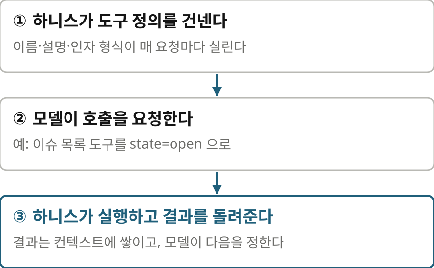

본론에 들어가기 전에 낯선 말 세 개를 짚고 갈게요. 먼저 도구 호출입니다. 언어 모델은 스스로 파일을 읽거나 인터넷에 접속하지 못해요. 그래서 하니스가 쓸 수 있는 도구의 이름과 설명, 인자 형식을 모델에게 건넵니다. 모델이 이 도구를 이렇게 불러 달라고 요청하면 하니스가 실제로 실행하고 결과를 돌려주죠. 그 결과는 대화 기록, 그러니까 컨텍스트에 쌓이고 모델은 그걸 읽고 다음 할 일을 정합니다. 한 번 부를 때마다 모델과 한 번 왕복하는 셈이에요.

> **하니스**란
> 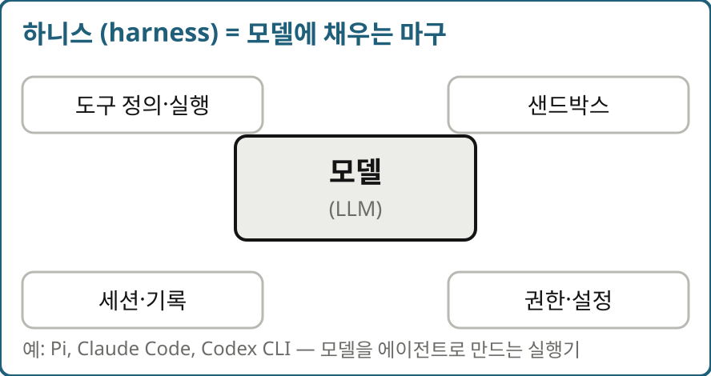

두 번째는 하니스입니다. 원래는 말에 채우는 마구라는 뜻인데요. 모델 하나만으로는 대화밖에 못 하니까, 도구를 정의하고 실행하고, 샌드박스를 두고, 세션과 권한을 관리하는 실행기가 모델을 감싸야 에이전트가 됩니다. 그 실행기가 하니스예요. Claude Code나 Codex CLI 같은 것들이 다 하니스고, 저자가 만든 Pi도 그렇습니다.

> **MCP**란
> 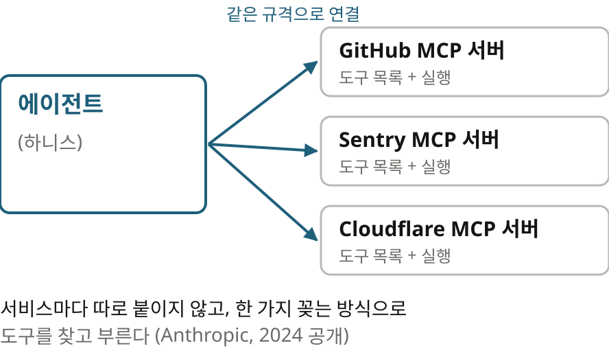

세 번째가 MCP, Model Context Protocol입니다. Anthropic이 2024년에 공개한 개방 규격이에요. GitHub든 Sentry든 서비스마다 따로 연결하지 않고 한 가지 방식으로 꽂으면, 에이전트가 그 서버의 도구 목록을 받아 와서 부를 수 있습니다. 편리하지만 서버를 붙일수록 도구 목록이 길어진다는 게 바로 저자가 경계해 온 지점이죠.

## 4 | Codemode란 | 한 줄 정의
> 도구 백 개 대신 / **도구 하나 안에서 / 프로그래밍**하게
> Codemode는 Pi의 codemode라는 도구 하나
> 모델이 JavaScript 스크립트를 넘기면, 격리된 런타임이 다른 도구를 부르고 결과를 가공해 최종 출력만 돌려준다

원문은 독자가 Codemode를 안다고 전제하고 시작해서 정리 노트는 Pi의 공식 문서를 바탕으로 정의부터 정리했어요. Codemode는 Pi에 있는 codemode라는 이름의 도구 하나입니다. 모델은 다른 도구를 하나씩 호출하는 대신 이 도구에 JavaScript 스크립트를 써서 넘겨요. 스크립트는 Pi 안의 격리된 런타임에서 돌면서 다른 도구들을 부르고 결과를 가공해서 최종 출력만 모델에게 돌려줍니다.

> 전화로 하나씩 묻기 / vs **쪽지 한 장**
> 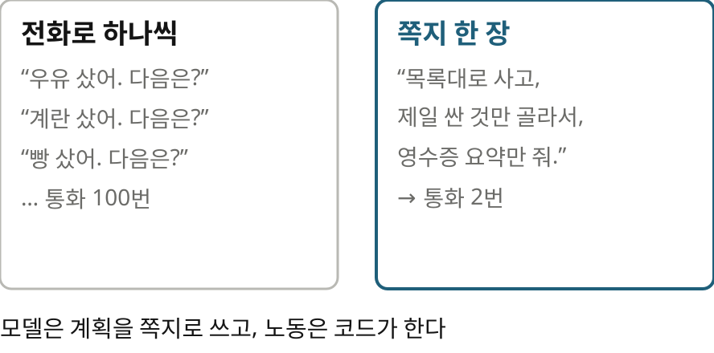

비유를 하나 들어 볼게요. 누군가에게 장보기를 맡겼는데, 물건 하나 살 때마다 전화해서 다음엔 뭘 사냐고 묻는다고 해 보죠. 백 가지를 사면 통화도 백 번입니다. 대신 쪽지 한 장에 목록대로 사고, 제일 싼 것만 고르고, 영수증 요약만 가져오라고 적어 주면 통화는 맡길 때와 받을 때 두 번이면 끝나요. Codemode에서 모델이 쓰는 스크립트가 이 쪽지입니다. 모델은 계획을 세우고 노동은 코드가 하는 거죠.

## 5 | Codemode란 | 왕복 비교
> 왕복 **101번**에서 **2번**으로
> 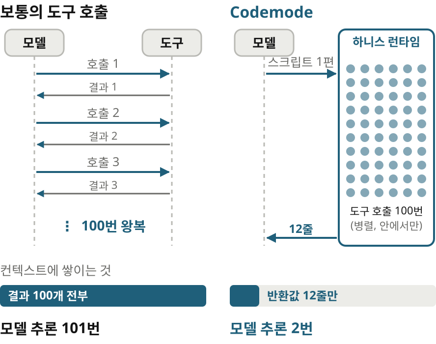

처음의 이슈 예시로 돌아가 볼게요. 보통의 도구 호출에서는 모델이 이슈 목록을 받고, 이슈 하나마다 분류 도구를 부를지 결정하고, 결과를 읽습니다. 왕복이 백한 번이고 컨텍스트에는 이슈 백 개와 분류 결과 백 개가 그대로 쌓여요. 결과가 길면 뒷부분이 잘리기도 하고요. Codemode에서는 모델이 추론 한 번으로 스크립트를 쓰고 하니스가 그걸 실행합니다. 도구 호출 백 번은 런타임 안에서 일어나고 모델에게 돌아오는 건 스크립트의 반환값뿐이에요. 모델의 추론은 스크립트를 쓸 때 한 번, 결과를 읽을 때 한 번으로 끝납니다.

> 100개를 읽고 **12개만** 돌려준다
> 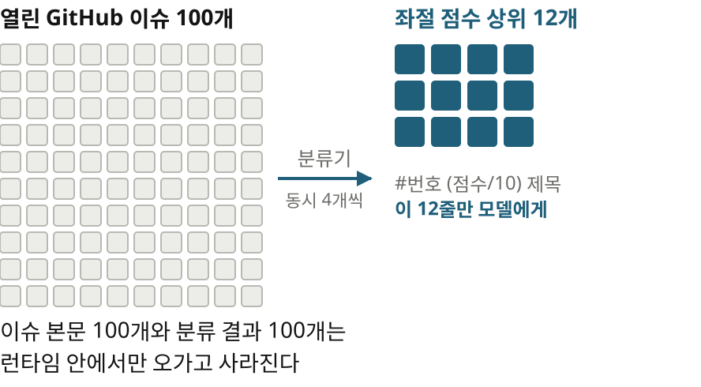

실제로 원문에는 이 예시가 Pi 세션에서 그대로 나와요. Jev라는 작은 분류 모델로 열린 이슈 백 개의 감정과 좌절 점수와 종류를 매기고, 가장 좌절한 이슈 열두 개만 돌려줍니다. 이슈 본문 백 개와 분류 결과 백 개는 런타임 안에서만 오가다 사라지고 컨텍스트에 들어오는 건 열두 줄이에요. 정리 노트는 이 예시를 글 전체에서 가장 설득력 있는 대목으로 꼽습니다.

## 6 | Codemode란 | 스크립트와 샌드박스
> 모델이 쓰는 코드는 / **이 정도 길이**
> 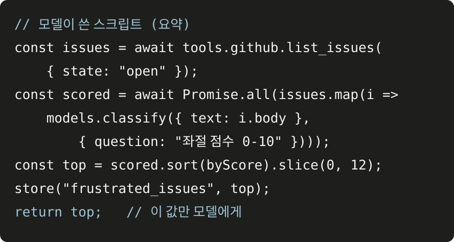
> 사람이 한 줄도 쓰지 않았다고 저자는 말한다

화면에 보이는 게 그런 스크립트의 요약입니다. 코드를 하나하나 읽을 필요는 없어요. 모양만 보시면 됩니다. 도구로 이슈를 가져오고, 분류기를 한꺼번에 부르고, 점수로 정렬해서 위의 열두 개만 남기고, 다음에 쓸 수 있게 저장한 뒤 그 값만 돌려줘요. 스크립트 안에서는 도구 호출 말고도 결과를 쌓아 돌려주는 함수, 작은 값을 다음 호출까지 남기는 store와 load, 쓸 수 있는 도구를 찾아보는 함수, 그리고 분류기나 이미지 생성기 같은 모델을 부르는 함수를 쓸 수 있습니다. 저자는 예시 코드를 사람이 한 줄도 쓰지 않았다고 해요.

> 모델이 쓴 코드는 **격리된 방**에서 돈다
> 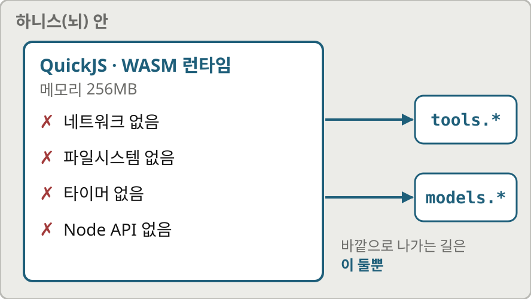

모델이 쓴 코드를 그냥 돌려도 되냐는 걱정이 들 수 있는데요. 스크립트는 WebAssembly 위에서 도는 QuickJS라는 작은 JavaScript 엔진 안에서 실행됩니다. 네트워크도, 파일시스템도, 타이머도, Node API도 없고 메모리는 256메가바이트로 묶여 있어요. 바깥 세상과 닿는 길은 tools와 models 두 가지뿐이고 스크립트가 다른 Codemode 스크립트를 띄울 수도 없습니다. 그래서 코드가 아무리 길어도 할 수 있는 일은 허용된 도구를 부르고 그 결과를 가공하는 것으로 묶여요.

## 7 | 뇌와 손 | 신뢰의 경계
> 하니스는 **뇌**, / 실행 환경은 **손**
> 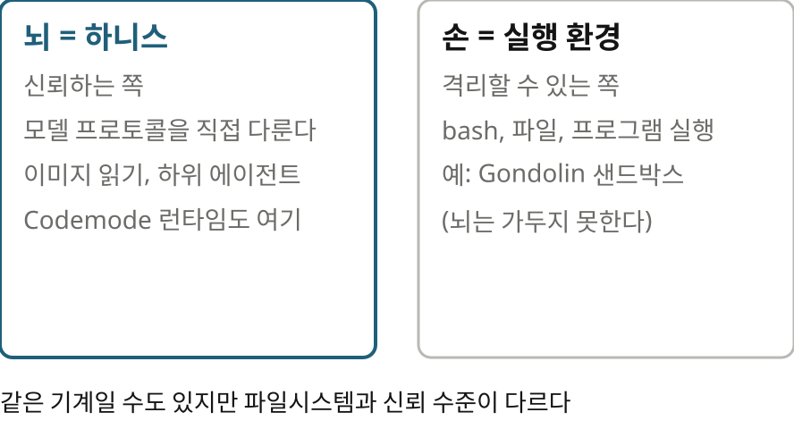

이제 원문의 흐름을 따라가 볼게요. 저자는 먼저 도구가 무엇인지 짚습니다. 하니스가 도구 정의를 건네고 모델이 어떤 도구를 언제 부를지는 강화학습으로 훈련된 결과라고요. 저자가 bash를 좋아하는 건 프로그램끼리 잘 조합되고 모델이 파일시스템이 어떻게 동작하는지 이미 배웠기 때문입니다. 다만 bash가 조합할 수 있는 건 실행 가능한 프로그램뿐이에요. 이미지를 읽거나 하위 에이전트를 띄우는 것처럼 하니스가 모델에게 직접 무언가를 넣어 줘야 하는 일은 하니스의 도구여야 합니다.

여기서 저자는 하니스를 뇌, 도구가 실제로 실행되는 환경을 손이라고 부릅니다. 둘은 같은 기계에 있을 수도 있지만 파일시스템과 신뢰 수준이 달라요. 손은 Gondolin 같은 샌드박스로 가둘 수 있지만 그런 샌드박스가 하니스 자체를 가두지는 않습니다. 이 구분이 글 전체의 전제예요. Codemode의 코드는 손이 아니라 뇌 안에서 돌기 때문에 방금 본 강한 격리가 필요한 거죠.

## 8 | 이점 | 저자가 드는 네 가지
> Codemode의 / 이점 **네 가지**
> 큰 출력이 잘리지 않고 구조화된 값으로 코드에 들어온다
> 동시 실행과 간단한 워크플로가 된다
> store로 상태를 남겨 다음 호출에서 쓴다
> 일반 도구로 노출하면 어색한 API를 컨텍스트 낭비 없이 쓴다

저자가 드는 이점은 네 가지예요. 첫째, 도구 출력이 아무리 커도 컨텍스트에서 잘리지 않고 구조화된 값 그대로 코드에 들어옵니다. 둘째, 여러 호출을 동시에 돌리거나, 몇 개만 먼저 찔러 보고 나머지를 한꺼번에 처리하는 간단한 워크플로를 짤 수 있어요. 셋째, store 함수로 상태를 남겨 다음 호출에서 이어 쓸 수 있습니다. 넷째, 이미지 생성이나 일회성 분류처럼 도구로 따로 노출하면 어색한 기능을 컨텍스트 낭비 없이 쓸 수 있어요. 이름은 Cloudflare가 먼저 쓴 걸 가져왔다고 밝힙니다.

> 핵심은 토큰 절약보다 / **거치지 않아도 될 데이터는 거치지 않기**

정리 노트의 해설을 하나 보태면, 토큰을 아끼자는 게 핵심은 아니에요. 컨텍스트를 거치지 않아도 되는 데이터는 거치지 말자는 쪽에 더 가깝습니다. 백 개의 결과를 모델이 읽고 하나씩 판단하는 대신 코드가 받아서 집계하고 모델에게는 요약만 돌려주는 거죠.

## 9 | 실제 모습 | 세 가지 예시
> 이미지 생성, 분류, **MCP 서버 부르기**
> 이미지: 쓸 수 있는 이미지 모델을 찾아 만들고, 결과는 모델에게도 디스크에도
> 분류: 이슈 100개, 그리고 탱크 게임을 30단계 동안 조종하는 루프
> Pi는 동시 실행을 4개로 제한하고 나머지는 줄을 세운다

원문은 실제 Pi 세션의 예시 세 가지를 보여 줍니다. 하나는 이미지 생성이에요. 쓸 수 있는 이미지 모델을 찾아 프롬프트로 이미지를 만들고 그 이미지를 모델에게도 보여 주고 디스크에도 남깁니다. 두 번째가 앞에서 본 분류예요. 같은 분류기로 탱크 게임을 서른 단계 동안 조종하는 예시도 있는데요. 매 단계 게임 상태를 분류기에 넣고 공격, 접근, 회피, 파워업 중 하나를 고르게 합니다. 백 개를 한꺼번에 던져도 괜찮은 건 Pi가 동시 실행을 네 개로 제한하고 나머지는 줄을 세우기 때문이에요.

> MCP 도구는 **필요할 때 찾는다**
> 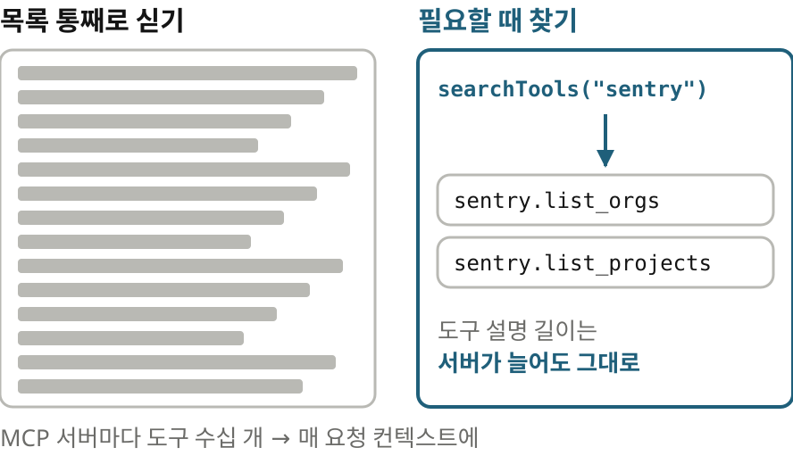

세 번째가 MCP 서버를 부르는 예시입니다. Codemode에서는 MCP 도구가 모델에게 바로 보이지 않아요. 도구 목록을 통째로 싣지 않고 스크립트가 필요할 때 검색해서 찾아냅니다. 이걸 점진적 발견이라고 불러요. 예시는 Sentry의 조직 목록을 받아 조직마다 프로젝트를 병렬로 조회하는 코드입니다. 서버가 늘어도 codemode 도구의 설명 길이가 흔들리지 않게 하려는 설계죠. 저자는 모델이 Sentry 도구의 모양을 훈련 데이터로 이미 아는 것 같다는 관찰도 덧붙여요.

## 10 | MCP와의 마찰 | 요즘 MCP는 싸움이다
> **Codemode 안의 Codemode**
> 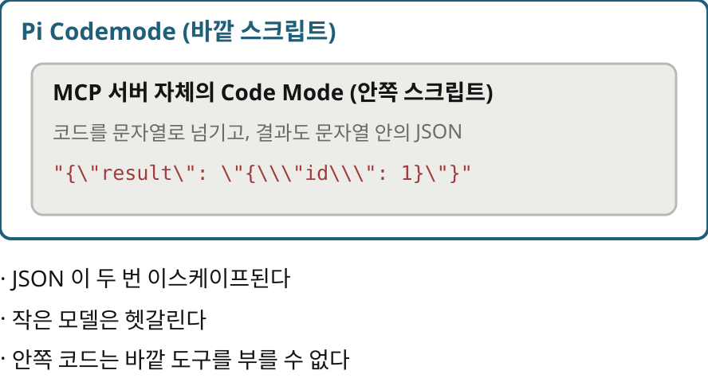

하지만 지금의 MCP와는 잘 안 맞는 부분이 있습니다. 저자는 이 절의 제목을 요즘 MCP는 싸움이다라고 붙였어요. MCP 서버 대부분은 Codemode가 없는 하니스를 겨냥해 만들어졌습니다. 그래서 Cloudflare를 비롯한 몇몇 서버는 자기 안에 Code Mode를 품고 있어요. 그런 서버를 Pi의 Codemode 안에서 부르면 Codemode 안의 Codemode가 됩니다. JSON이 두 번 이스케이프되고, 작은 모델은 헷갈리고, 안쪽 코드는 바깥 도구를 부를 수 없어요. 저자는 이걸 최선은 아니지만 이해할 만한 일이라고 봅니다.

> MCP 서버에 바라는 것
> 구조화된 JSON 출력, 가능하면 outputSchema로 선언
> **일관된 결과 형태**
> 큰 바이너리 데이터 지원
> 여러 서버를 가로지르는 도구 검색

그래서 저자는 MCP 서버에 바라는 것 네 가지를 적어요. 첫째, 텍스트 덩어리가 아니라 코드가 바로 다룰 수 있는 구조화된 JSON을 돌려줄 것. 출력 형식을 미리 선언해 두면 가장 좋습니다. 둘째, 결과의 모양이 늘 같을 것. 셋째, 큰 바이너리 데이터를 제대로 지원할 것. 지금은 미리 서명된 URL 같은 우회가 어색하다고 해요. 넷째, 여러 MCP 서버를 가로질러 도구를 검색할 수 있을 것. 지금은 우연히 되는 수준이라 서버가 늘면 버티지 못한다고요.

> 탐색은 통과하고 / **본 실행에서 깨진다**
> 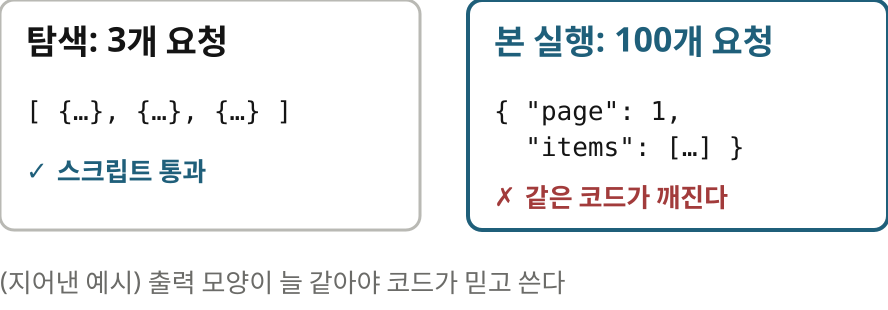

두 번째 바람은 예를 들어 보면 와닿아요. 화면의 예시는 이해를 돕기 위해 지어낸 겁니다. 스크립트가 처음에 세 개만 요청해서 결과 모양을 보고 코드를 짰는데, 백 개를 요청하니 서버가 페이지로 감싼 다른 모양을 돌려준다고 해 보죠. 작은 탐색은 통과했는데 정작 본 실행에서 같은 코드가 깨집니다. 사람이 하나씩 부를 땐 넘어갈 수 있는 차이가 코드에게는 치명적이에요.

## 11 | 앞날 | 남은 과제
> 예전 조언을 / 뒤집는 게 아니라 / **하니스 안으로 확장**한 것
> 내구성: 호출을 스냅샷해 이어 가려면 내구성 워크플로 엔진의 아이디어가 필요할지 모른다
> 언어: 결정적인 조합 언어로는 JavaScript보다 Starlark가 나을지도
> 바이너리 데이터와 이미지, 작은 모델에서는 아직 약하다

글의 마지막에서 저자는 이게 예전의 CLI 권고를 뒤집는 게 아니라고 말해요. MCP가 자신이 권했던 코드 기반 접근 쪽으로 움직였고, Codemode는 그걸 하니스 안으로 확장한 것이라는 입장입니다. 남은 문제도 솔직하게 적어요. 실행 중인 호출을 스냅샷해서 나중에 이어 가려면 내구성 있는 워크플로 엔진의 아이디어를 빌려야 할 수 있다는 것. 조합 언어로는 JavaScript보다 실행이 결정적인 Starlark가 나을지 모른다는 것. 그리고 바이너리 데이터와 이미지, 작은 모델에서는 이 패턴이 아직 약하다는 것. 결론은 완성된 답은 아니지만 앞으로 더 쓰게 될 패턴이라는 겁니다.

## 12 | 맺으며 | 남는 생각
> 읽으며 **짚어 둘 점**
> 저자 자신의 하니스 Pi를 기준으로 쓴 글. 다른 하니스가 같은 격리를 주는지는 별개
> MCP 생태계는 아직 이 패턴을 전제하지 않는다. 서버마다 궁합이 다를 수 있다
> 이점 가운데 수치로 뒷받침된 것은 없다. 경험에서 나온 설계 주장

읽으면서 짚어 둘 점도 있어요. 이 글은 저자 자신의 하니스 Pi를 기준으로 쓰였습니다. 다른 하니스가 같은 격리를 주는지는 따로 따져 봐야 해요. Codemode 안의 Codemode 문제는 MCP 생태계가 아직 이 패턴을 전제하지 않는다는 뜻이니, 지금 당장은 서버마다 궁합이 다를 수 있고요. 그리고 저자가 말하는 이점 가운데 수치로 뒷받침된 건 없습니다. 경험에서 나온 설계 주장으로 읽는 게 맞아요.

> 차이는 **조합이 일어나는 자리**
> 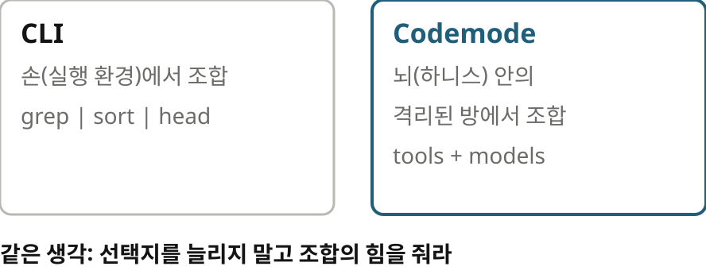
> 원문 lucumr.pocoo.org, 정리 노트 yoon-gu.github.io/compendium

마지막으로 제 생각을 보태면, CLI를 쓰라는 예전 조언과 Codemode는 같은 생각의 두 모습이에요. 모델에게 선택지를 많이 보여 주는 대신 조합의 힘을 주라는 것. 차이는 조합이 일어나는 자리입니다. CLI는 손, 그러니까 실행 환경에서 조합하고 Codemode는 뇌 안의 격리된 방에서 조합해요. 그 방에서 무엇을 어디까지 할 수 있게 할지가 다음 설계 과제겠죠. 여기까지, Armin Ronacher의 What is Codemode였습니다.
