# GenRec — 오디오 오버뷰 화면 대본

NotebookLM 오디오 오버뷰(두 진행자의 대화, 21분 54초)에 맞춰 넘어가는 화면 대본. 나레이션은 녹음하지 않고 `work/overview.bin`(m4a)을 그대로 입힌다.
화면 문구는 대화의 흐름과 [정리 노트](../../content/notes/genrec-netflix.md)의 논문 내용을 함께 참고해 썼다.

`python3 ../build.py genrec-netflix --audio=work/overview.bin` 으로 굽는다(세로 1080x1920).
각 화면의 첫 나레이션 줄은 `@분:초` 로 시작하고, 그 시각부터 다음 화면 시각 전까지 그 화면이 뜬다. 나레이션 줄의 나머지는 그 대목의 대화 요지(읽히지 않음).

출처: Netflix, 〈GenRec〉 arXiv 2608.10257, 2026년 8월
잉크: #8A1C2B
약어: LLM=Large Language Model, 거대 언어 모델; MRR=Mean Reciprocal Rank, 평균 역순위; GPU=Graphics Processing Unit; MLP=Multi-Layer Perceptron, 다층 퍼셉트론; RL=Reinforcement Learning, 강화학습; GRPO=Group Relative Policy Optimization; KV 캐시=Key-Value cache, 어텐션 키·값 저장; A/B 테스트=두 버전(A, B)을 사용자 집단을 나눠 비교하는 실험; AI=Artificial Intelligence

## 1 | 들어가며 | 표지
> GenRec: 넷플릭스의 / LLM 기반 추천 랭커
> GenRec: An LLM-Backed Recommendation Ranker at Netflix, arXiv 2608.10257
> Netflix, 2026년 8월 · 두 진행자가 대화로 풀어 읽는 논문

@0:00 넷플릭스 알고리즘이 수학 계산을 멈추고 마음을 읽기 시작한다면?

> 그동안의 추천 시스템은 **거대한 스프레드시트**였다
> 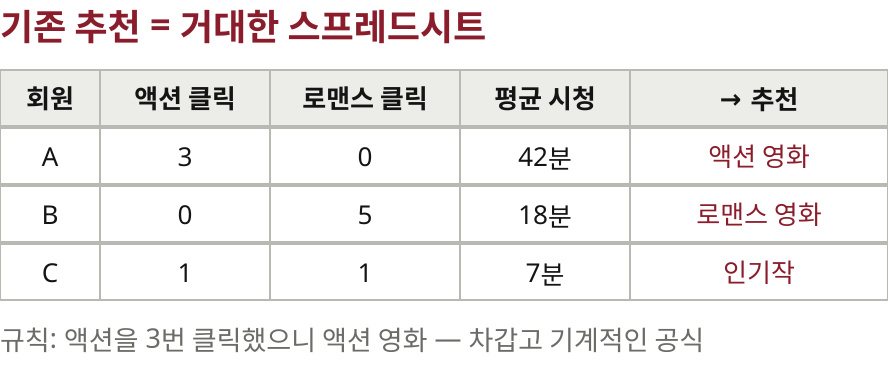

@0:17 기존 추천 시스템은 거대한 엑셀 스프레드시트 같았다는 비유.

> 오늘의 논문 **GenRec**
> 넷플릭스의 LLM 기반 추천 랭커
> 익숙했던 공식이 깨졌다. 전통 알고리즘을 버리고 LLM으로

@0:37 오늘 다룰 논문 GenRec 소개. 거대 기술 기업이 전통 알고리즘을 버리고 LLM으로 전환.

## 2 | 기존 시스템의 병목 | 왜 바꾸는가
> 기존 랭커는 **수천 개의 손설계 피처**에 기댔다
> 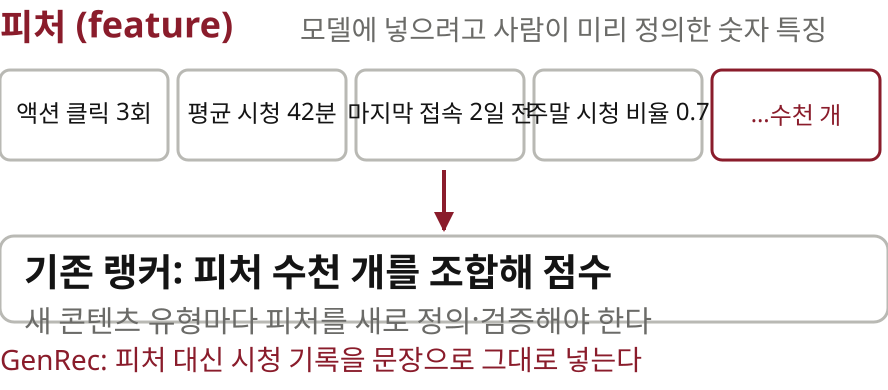
> 목적마다 전용 네트워크·트랜스포머·멀티태스크 구조를 겹겹이 쌓은 상태

@1:41 변화의 이유를 알려면 기존 시스템의 병목부터. 수천 개의 수작업 피처, 겹겹이 쌓인 맞춤형 아키텍처.

> **루브 골드버그 장치**란
> 
> — 영상: Purdue Engineering, 2019 전국 연쇄반응 대회 우승작, CC BY 3.0, Wikimedia Commons

@2:26 루브 골드버그 장치 비유. 구슬을 굴리면 꼬불꼬불한 길을 지나 마지막에 종을 치는 기계. (클립 원본: https://commons.wikimedia.org/wiki/File:2019_Purdue_National_Chain_Reaction_Competition_Winner.webm — work/ 에 받아 둔다)

> 구슬 전용 기계에 / **탁구공**을 굴린다면
> 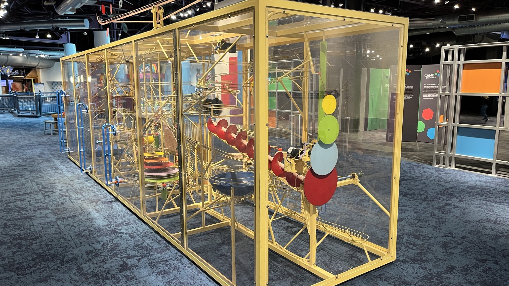
> — 사진: Mbrickn, Imagination Station, CC0, Wikimedia Commons

@2:50 구슬 전용으로는 완벽한데, 게임·라이브·팟캐스트가 들어오자 레일을 전부 뜯어 고쳐야 하는 상황.

> 이름의 유래 — 만화가 **루브 골드버그**의 1931년 작품
> 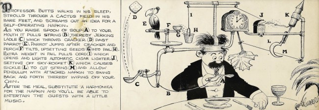
> — 냅킨 하나를 쓰려고 열세 단계를 거치는 '자동 냅킨' · Rube Goldberg, 1931, 퍼블릭 도메인

@3:01 (대화는 탁구공·주사위 비유) 화면은 이름의 유래가 된 원작 만화.

> 새 공이 올 때마다 **레일을 전부 뜯어 고쳐야** 한다
> 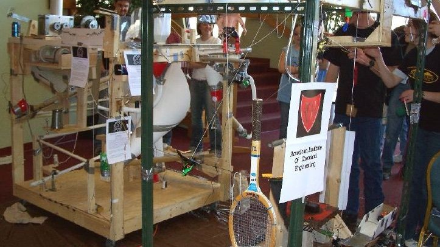
> — 사진: jclarson, CC BY 2.0, Wikimedia Commons

@3:12 탁구공을 굴리려면 기존 레일을 전부 뜯어 고치고, 새 무게·마찰에 맞춰 톱니를 다시 깎아야 한다.

> 새 콘텐츠 유형 하나에 **피처·모델·인프라를 다시 설계**
> 사업이 커지는 속도를 시스템의 복잡성이 따라가지 못한다

@3:26 새 콘텐츠 유형이 추가될 때마다 피처를 수학적으로 정의하고 아키텍처를 새로 짜야 하는 장벽.

> 그래서 **LLM**으로 눈을 돌렸다
> 세계 지식과 언어 이해를 이미 갖춘 모델
> 레일을 밤새 깎는 대신, 모델에게 말로 설명한다

@3:44 LLM은 이미 세상에 대한 지식과 언어를 이해하니, 탁구공용 레일을 깎는 대신 말로 설명하면 된다.

## 3 | 두 단계 학습 | Phase 1과 Phase 2
> **2단계 프레임워크**
> 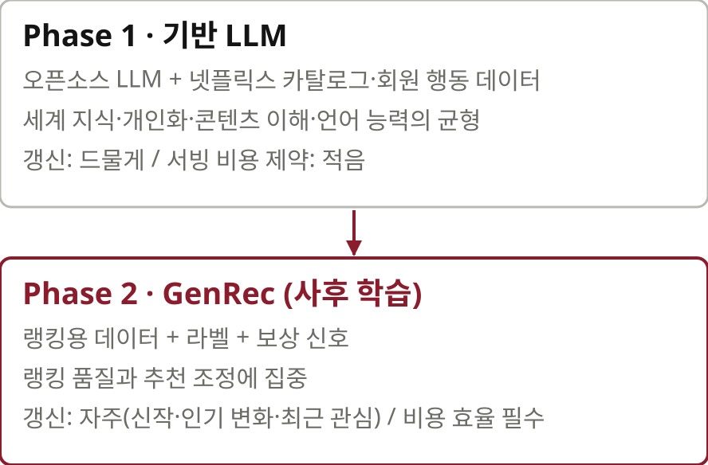

@4:20 넷플릭스는 외부 모델을 그대로 쓰지 않고 2단계 프레임워크로 풀었다. Phase 1은 기반 다지기, 넷플릭스 맞춤 과외.

> Phase 1만으로 오프라인 추천 품질 **+10-20%**
> 기성 LLM을 백본으로 쓸 때와 비교. 지표는 MRR(평균 역순위): 보고 싶은 작품이 목록의 얼마나 앞에 뜨는가
> $$\mathrm{MRR}=\frac{1}{|Q|}\sum_{q\in Q}\frac{1}{\mathrm{rank}_q}$$

@4:54 Phase 1만 거쳐도 기성 모델보다 오프라인 품질이 10-20% 오른다. 지표는 MRR.

> MRR이란 — 보고 싶은 작품이 **첫 줄 첫 칸**에 얼마나 가까운가
> 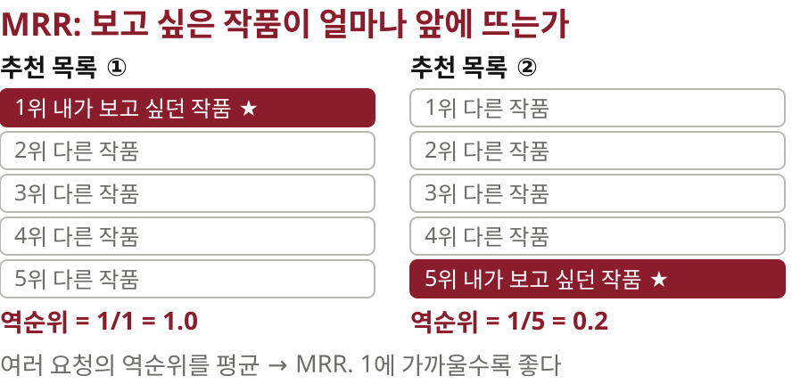

@5:07 MRR 설명. 내가 진짜 보고 싶은 영화가 추천 목록 첫 번째 칸에 얼마나 가깝게 뜨는지.

> Phase 2 사후 학습으로 다시 **+35-50%**
> 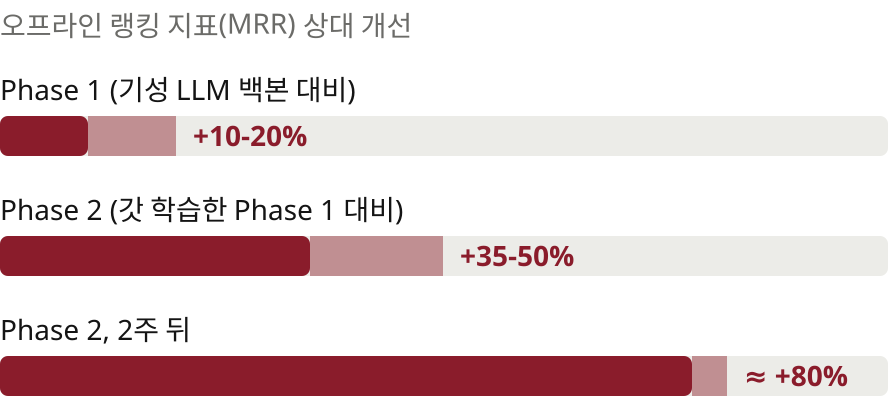
> Phase 1의 지식이 낡아 갈수록 Phase 2의 몫이 커진다

@5:28 탄탄한 기반 위에서 Phase 2. 랭킹이라는 구체적 작업에 고빈도 사후 학습. 35-50% 추가 향상, 시간이 지나면 80%.

> 「수억 명에게 매초 거대 모델을 돌린다고요?」
> 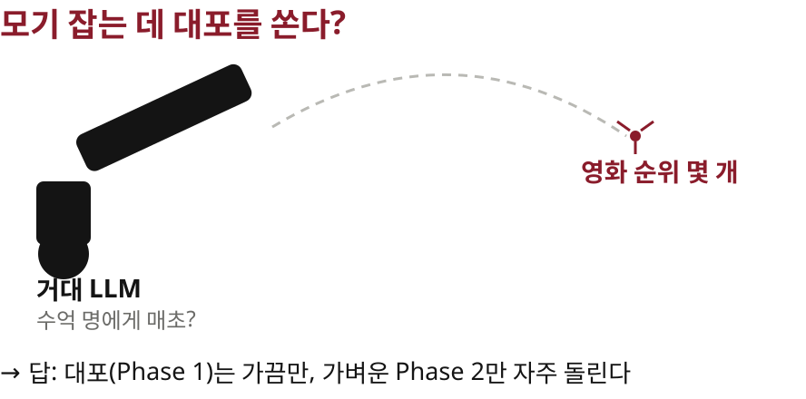

@6:05 그 무거운 모델을 수억 명에게 매일 돌리면 서버 비용으로 파산하지 않나? 모기 잡는 데 대포.

> 대포는 **매일 쏘지 않는다**
> 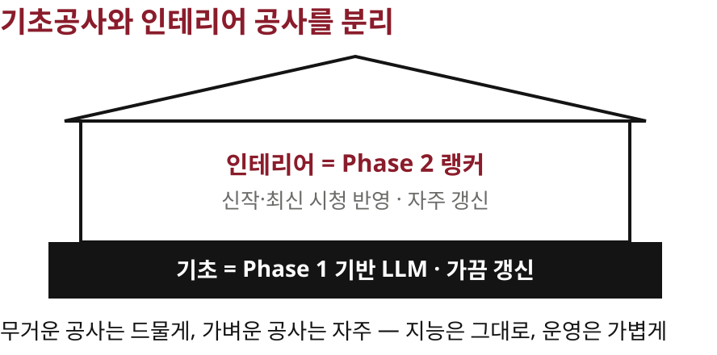

@6:46 2단계 구조의 핵심은 갱신 주기의 분리. 기초공사와 인테리어 공사를 분리한 것.

## 4 | 언어화 | 피처에서 컨텍스트로
> 수치는 버렸다. 시청 기록을 **문장으로** 넣는다
> 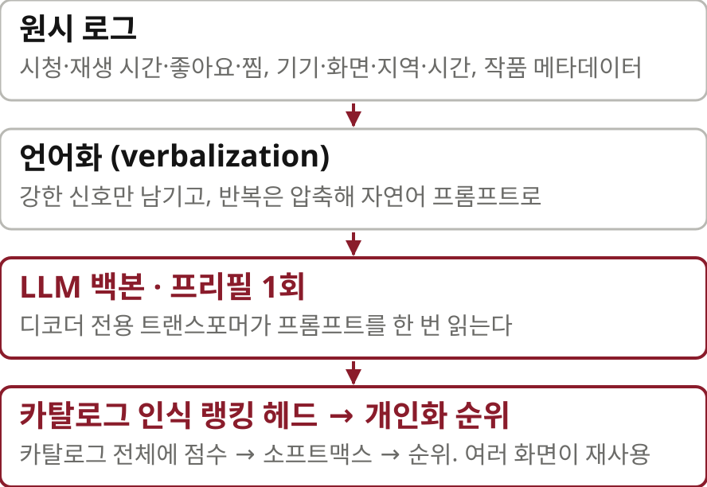

@7:44 수학 기호로 쪼개 넣던 시청 기록을 이제 어떻게 전달하나. 논문은 이 과정을 언어화라 부른다. 피처 엔지니어링에서 맥락 엔지니어링으로.

> 수년치 시청 기록을 전부 글로 줄 수는 없다 — **토큰 예산**
> 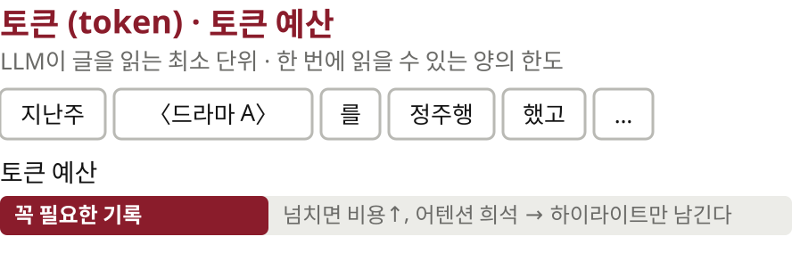

@8:32 모델에게 수년치 기록을 다 쓸 수는 없다. 토큰 예산의 한계.

> 친구에게 휴가 이야기를 하듯 **하이라이트만**
> 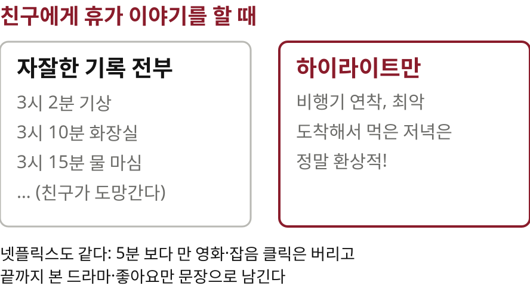
> 남긴다·버린다·압축한다·보강한다 — 논문의 네 가지 규칙

@9:01 휴가 다녀온 이야기 비유. 자잘한 기록은 빼고 하이라이트만. 논문의 네 가지 규칙.

> 주말에 몰아본 에피소드 10개는 **'그 시리즈 정주행'** 하나로
> 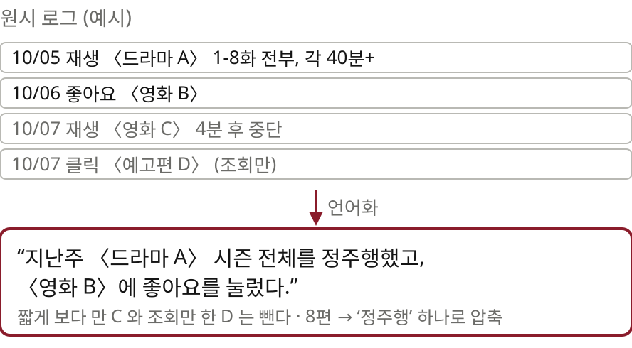

@9:49 같은 시리즈 10편 연달아 본 기록은 하나의 맥락으로 압축.

> 컨텍스트 **5,000 토큰 → 약 1,700 토큰**
> 

@10:04 최적화 뒤 품질은 거의 안 떨어지면서 컨텍스트가 5000에서 1700 토큰으로, 비용도 3분의 1.

## 5 | 카탈로그 인식 랭킹 헤드 | 환각 차단
> 「카탈로그에 없는 영화를 지어내면 어떡하죠?」
> 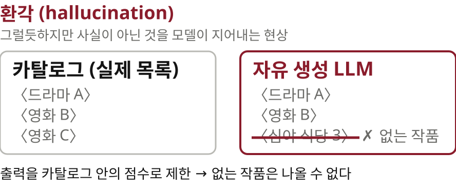

@10:58 또 다른 의문, 환각. 없는 영화 제목을 지어내 추천하면?

> **객관식**처럼 보기 안에서만 고르게 할 수는 없을까
> 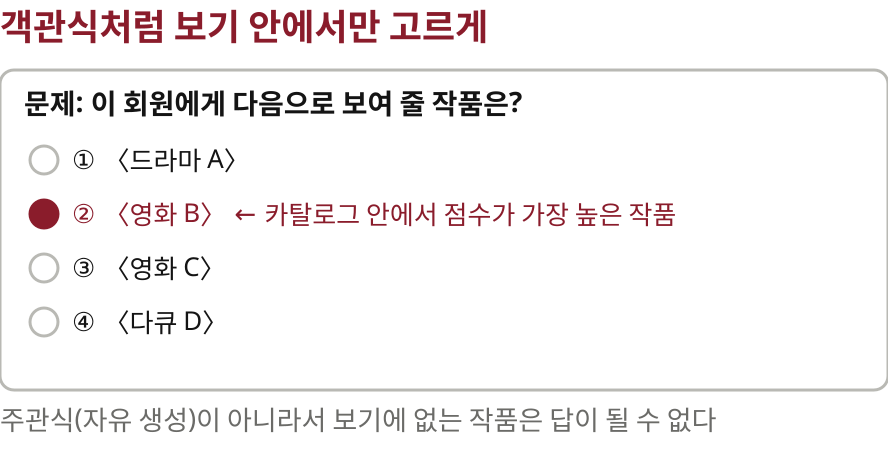

@11:20 출력을 기존 아이템 목록 안에 가둘 수는 없나. 객관식 문제처럼 보기 안에서만 답을 고르도록.

> **카탈로그 인식 랭킹 헤드**
> 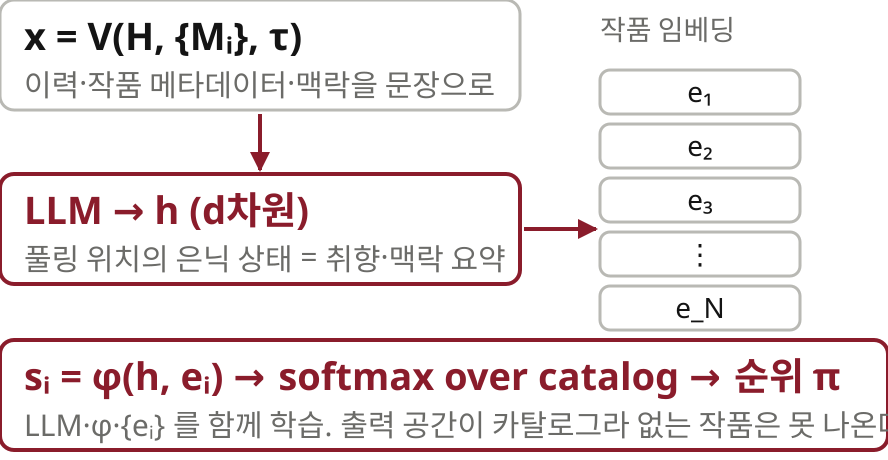
> $$s_i=\phi(h,e_i),\qquad p_i=\frac{e^{s_i}}{\sum_{j\in C}e^{s_j}}$$

@11:32 논문의 핵심 아키텍처, 카탈로그 인식 랭킹 헤드. 자유 생성을 막고 실제 아이템 안에서만 순위 점수.

## 6 | 보상 신호 | 클릭이 아니라 장기 만족
> 「자극적인 썸네일과 인기작만 들이밀면?」
> 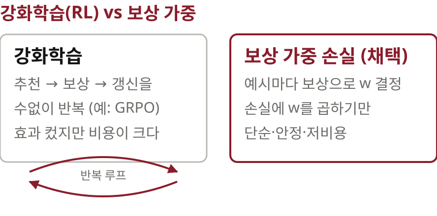

@12:03 환각은 해결됐고, 통제 문제. 자극적 썸네일, 세계적 인기작만 추천할 수도.

> **보상 가중 랭킹 손실**
> 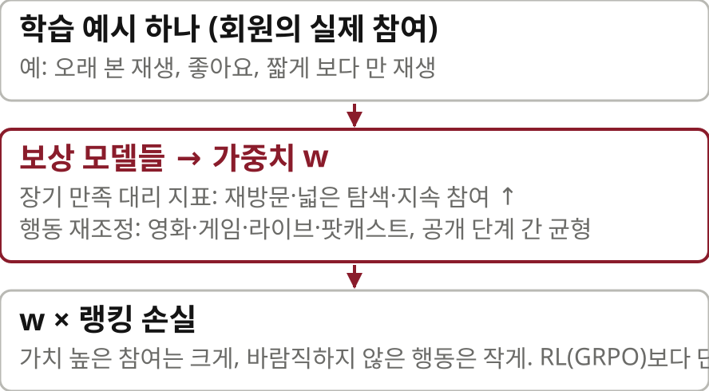
> $$\mathcal{L}=\alpha\,\mathcal{L}_{\text{rank}}+\beta\,\mathcal{L}_{\text{lang}}+\gamma\,\mathcal{L}_{\text{misc}}$$

@12:38 비용이 큰 강화학습 대신 보상 가중치를 둔 랭킹 손실. 단기 클릭보다 구독 유지와 탐색에 높은 보상. 콘텐츠 유형 균형.

## 7 | 서빙 | 프리필 전용
> **프리필 전용(prefill-only)** 추론
> 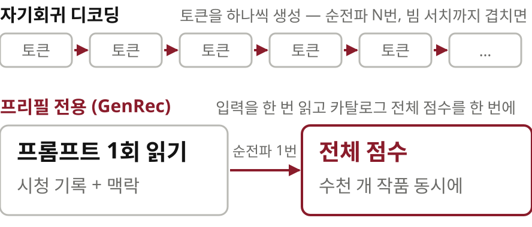

@13:18 비용 통제의 핵심, 프리필 전용. 자기회귀 디코딩으로 추천 100개를 한 글자씩 띄우면 속이 터진다. 한 번의 패스로 병렬 점수.

> 추천의 토양이 **LLM 인프라**로 옮겨 갔다
> 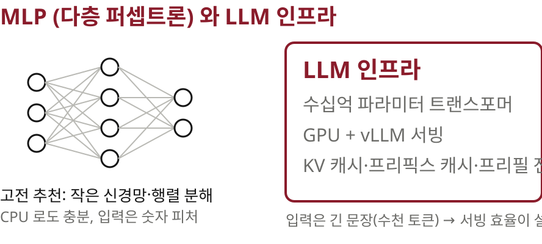

@14:24 거시적 인프라 관점. MLP 같은 고전 신경망 인프라에서 vLLM과 GPU 캐싱 같은 현대 LLM 인프라로.

## 8 | 실험 결과 | A/B 테스트
> 이론은 좋다. **실전에서도 이겼을까?**
> 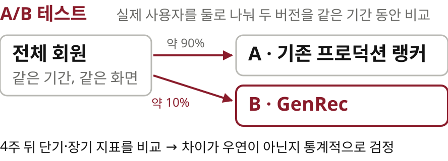

@15:10 이론은 좋은데 실전은? 실제 사용자로 검증하는 A/B 테스트.

> **4주, 트래픽 약 10%**의 온라인 A/B 테스트
> 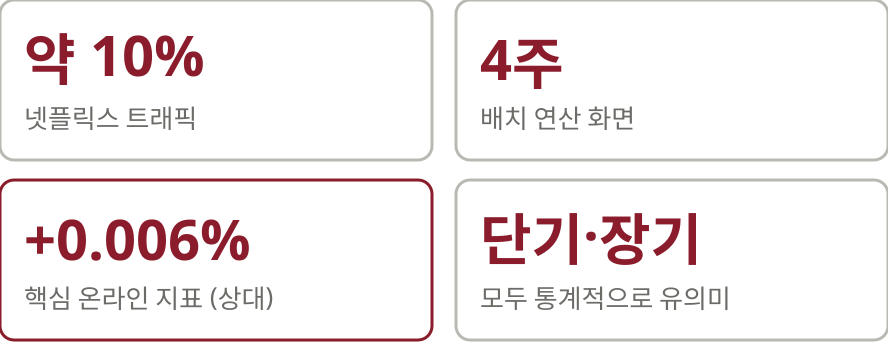
> 넷플릭스 규모에서 +0.006%는 의미 있는 차이

@15:34 4주간 트래픽 10% A/B 테스트. 단기 클릭률과 장기 시청 시간 모두 유의미한 향상.

> 더 놀라운 건 데이터의 양
> Phase-2 라벨 학습 예시를 **약 40배 적게** 쓰고도
> 오프라인 MRR 상대 +1.6%

@16:14 성능보다 충격적인 건 사용한 데이터 양. 40배 적은 Phase 2 라벨링 데이터.

> 다다익선이 아니었던 이유 — **Phase 1의 사전 지식**
> 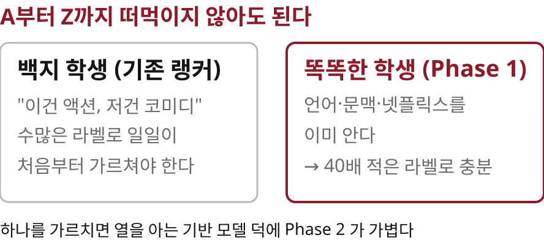

@16:54 40배 적어도 되는 이유는 Phase 1 모델의 사전 지식. 하나를 가르치면 열을 아는 기반 모델.

> **스케일링 법칙**이 추천에도 그대로
> 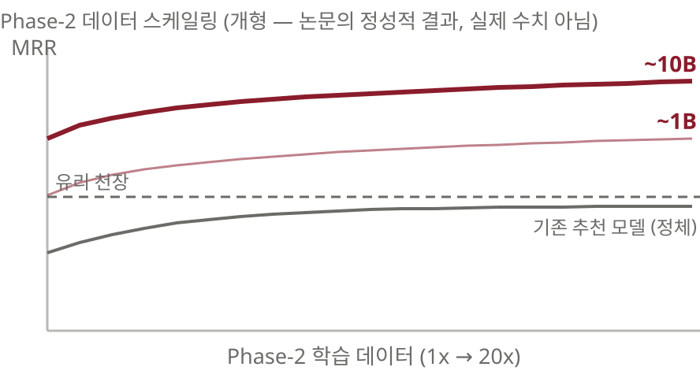
> 같은 학습 예산에서 큰 백본(~10B)이 작은 백본(~1B)보다 일관되게 우위

@17:33 확장 법칙. 데이터와 모델이 커질수록 품질이 단조 증가. 기존 추천 모델의 유리 천장이 깨졌다.

## 9 | 패러다임 전환 | 서사와 맥락의 시대
> 수치와 피처의 시대에서 **서사와 맥락의 시대**로
> 프롬프트가 새로운 피처 벡터다
> 맞춤 아키텍처 → 기반 백본 / 추천 인프라 → LLM 인프라

@18:28 이게 무슨 의미인가. 가중치를 소수점 단위로 깎던 시대는 끝났다. 행동 데이터를 언어와 스토리로 얼마나 잘 번역해 먹이느냐의 싸움.

> 디지털 발자국은 공식의 변수가 아니라 **하나의 이야기**
> 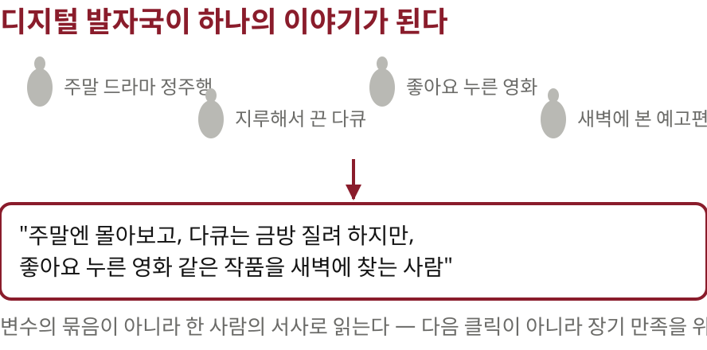

@19:13 디지털 발자국의 의미가 바뀐다. 파편화된 변수가 아니라 고유한 이야기로. 장기 만족을 위해 분석된다.

## 10 | 맺으며 | 열린 질문
> 「AI가 내놓은 **인생의 추천 목록**을 믿고 따르시겠습니까?」
> 영화의 맥락을 넘어 삶의 맥락까지 파고든다면
> — 논문에는 없는, 진행자의 질문

@20:15 논문에는 적혀 있지 않지만 던지는 질문. 모든 디지털 발자국을 하나의 서사로 읽어 삶의 결정까지 추천한다면.

> 읽을 때 유의할 점
> 결과는 상대 수치와 범위뿐, Phase 1 기반 모델은 비공개, 온라인 실험은 배치 화면 한정
> 원문 arxiv.org/abs/2608.10257 · 정리 노트 yoon-gu.github.io/compendium

@21:32 마무리. 논문이 밝히지 않는 것과 원문·정리 노트 안내.
